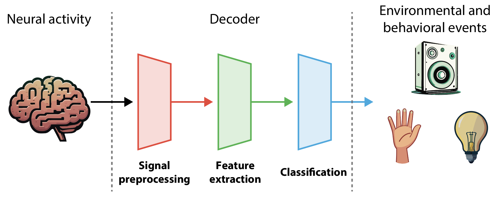

# Decoding the Brain

## Description

This course shows you how to extract information from brain signals. Traditionally this was useful for understanding how the brain works, but there is growing relevance for building brain-computer interfaces. We will cover the basic physiology and physics of brain signals, how to process them, decoding them with several types of machine learning algorithms, and evaluating decoder performance. EEG, ECoG, and spiking data will used. All coding will be done in Python. By the end of the course, you will be able code your own decoders of brain activity.

## Setting up the environment
This course uses packages outside the standard python distribution. To work with these, we will set up an evironment, *decode_brain*. To do this:
1. If you haven't already, download and install [Anaconda](https://www.anaconda.com/download) for managing python environments.
2. Download course repository. On the [course github page](https://github.com/dbheadley/DecodingTheBrain), click the green *Code* button near the top right of the page. On the drop down menu, click the *Download Zip* button. Unzip the repository wherever you normally store you code.
3. Open the command terminal. On a Windows computer search for the Anaconda Prompt application and open it. If you are using a Mac/Linux use the 'Terminal' app.
4. In the terminal, navigate to the course repository directory by typing `cd FULLPATH`, where FULLPATH is the complete path to the course directory. 
5. To create the environment, enter the command `conda env create -f environment.yml`
6. Once that has run, you can start using the environment by typing `conda activate decode_brain`
7. Now that you are in the environment, we can start coding using Jupyter notebooks. To do this, enter the command `jupyter notebook`
8. You should be able to access all the lectures as jupyter notebooks. These can be found in each week directory, in the file named *notes.ipynb*
9. To start creating your own notebook, on the jupyter notebook main page click on the *New* button and select *Notebook*