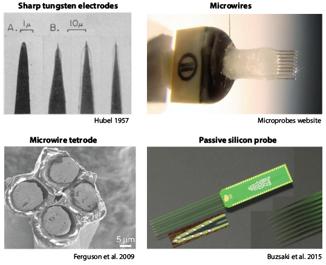
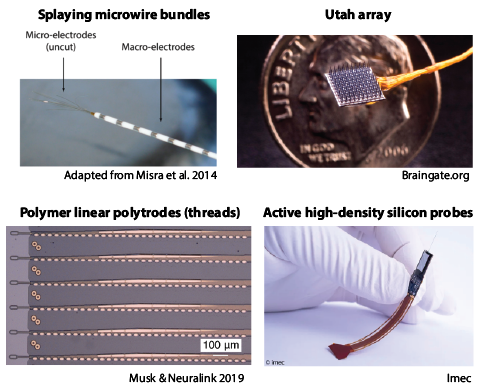
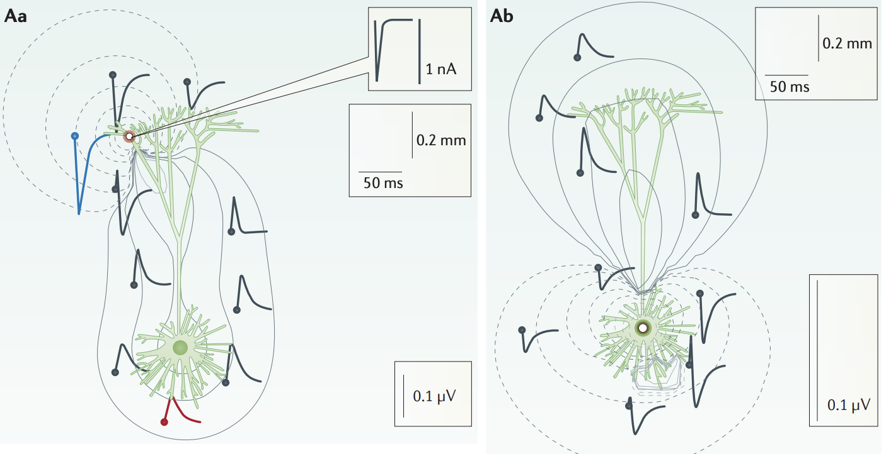
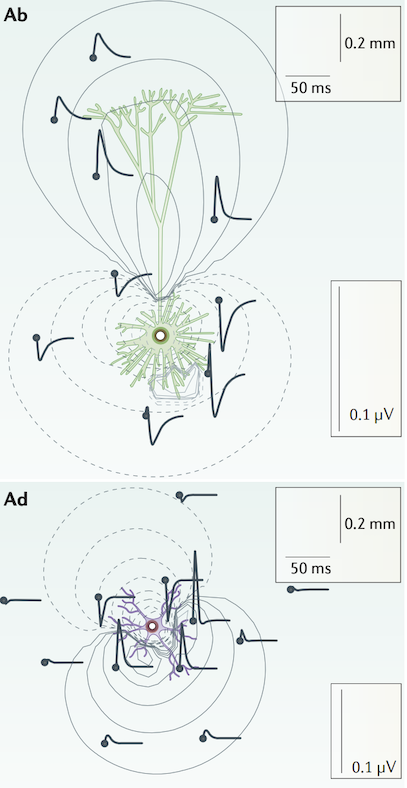
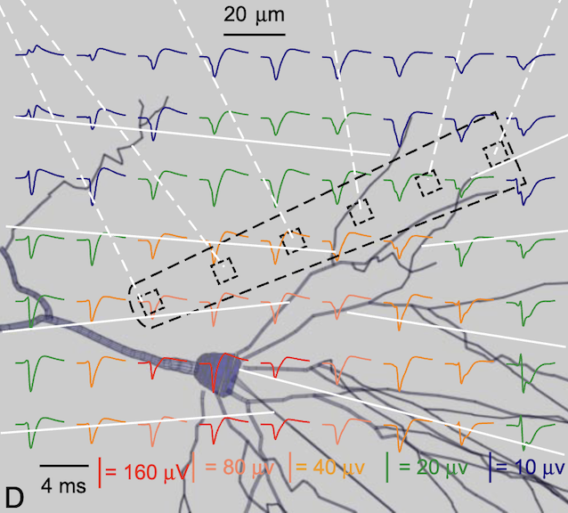

# Processing neuronal spikes

```{python}
import os
import sys
sys.path.append('..')
import numpy as np
import pandas as pd
import matplotlib.pyplot as plt
from scipy.signal import butter, freqz, filtfilt, find_peaks
from scipy.ndimage import gaussian_filter1d
from sklearn.decomposition import PCA
from sklearn.cluster import KMeans
from source.utils import zscore
np.random.seed(47)
```

## Action potentials and extracellular spikes

In Week 1 we simulated a sheet of neurons and then moved a simulated electrode closer and closer to them. Recall that neurons receive relatively slow (50 ms long) synaptic inputs that occasionally trigger them to fire an action potential. Action potentials are large, brief (\~1ms), positive going swings of the membrane voltage. These are conducted down the neuron's axon towards its target, eliciting a synaptic response. All these events can be detected by electrodes placed near the neurons, with the distance of the electrode from the neuron strongly impacting which are seen.


When the electrode was at 2 cm we only saw a weak slow signal that reflected the shared excitability of all the neurons and their correlated synaptic drive. This signal resembles what is seen with EEG electrodes placed on the scalp. As we moved the electrode closer, to be 0.5 mm from the neurons, as is the case with ECoG electrodes, the signal got stronger and high frequency buzzing appeared that reflected the activity of small populations of neurons. Finally, moving our electrode to within 10 um of a single neuron (less than the thickness of a human hair), we could see the extracellular reflection of its action potential towering over the slow shared synaptic signals. This signal is what is seen when small tipped electrodes are inserted into the brain near neurons. The extracellular action potentials are referred to as *spikes* and the slow activity resembling the ECoG signal is generally referred to as the *local field potential* (LFP). Because the notion that spikes arise from extracellular action potentials is often an inference - we don't independently confirm it with another measurement modality - we often refer to the source of a spike as a *unit* and not a neuron. But frequently we will use the terms interchangeably. When a particular collection of spikes are thought to arise from just a single neuron they are called *single unit activity*. If we think that multiple neurons contribute to the spikes, then they are called *multiunit activity*.

Over the years, a variety of electrodes have been used to record spikes. The general principle is that the recording site is small and lies somewhere along a thin shaft. The size of the recording site can vary, but generally its diameter is on the order of a single neuron, \~15 um. Electrodes originally tended to be sharpened tungsten needles insulated to within a few microns of the tip. To make these, a rod of tungsten is etched to a point by repeatedly dipping it in acid, then coated with a varnish to insulate it, followed by placement in a sparking chamber to burn off a microscopic portion of insulation at the tip. With these one could easily record single unit activity. Microwires can be used as well. These are easier to manufacture, you just buy the wire, which ranges from 10 to 50 microns in diameter, and then bundle them into an array with the desired configuration. Because of their large recording surface areas, on each electrode one typically detects spikes arising from many units that are difficult to separate. To allow for better separation of units, in the late 1970s and early 80s workers began to bundle their microwires into 'stereotrodes' and 'tetrodes' by twisting them together. This allowed for the detection of many units, but each with its own distinct waveform profile across the adjacent recording sites in a bundle. Those variations in waveform shape acted like fingerprints, unique to each neuron, allowing them to be sorted into single units. In the early 2000s investigators began using silicon probes (although they had been developed in the 1960s). Silicon probes are fabricated using thin film lithographic techniques, similar to early computer chips. These allows for groups of recording sites precisely shaped and positioned, such as having circular recording sites staggered at regular intervals.



Those reviewed above have primarily been used in animal studies, but there are designs that are intended for human use. The current favorite is a splayed bundle of microwires that emerges from a shank containing large electrodes capable of recording signals akin to the ECoG. The shank is inserted deep into the brain to access structures that are not on the cortical surface (typically the hippocampus or amygdala in patients undergoing treatment for medial temporal lobe epilepsy). Another design, the Utah Array (designed at the University of Utah), is an array of sharpened silicon electrodes that is pushed into the cortical surface, providing unit activity from neurons immediately under the array. A drawback to this design is that the dense array of recording needles can cause damage and the sharp electrodes have poor long term performance when recording single unit activity. To overcome those challenges, Neuralink has designed a soft electrode array where the recording sites are spaced along its length. These are then inserted rapidly one at a time into the brain using a robotic device and then left to 'float' in the brain. This minimizes mechanical damage caused by the insertion and chronic damage since the electrodes will move with the brain. It recently won FDA approval for testing in humans (but without some controversy!). Lastly, recently developed electrodes have adapted the same chip fabrication technology that makes image sensors in cell phones to create high density electrode arrays with thousands of recording sites. These probes include all the amplification, filtering, and digitization, meaning that only a single two-wire cable is required to stream the data to a computer. These have begun to be used intraoperatively to decode human brain activity (e.g. [speech decoding](https://www.nature.com/articles/s41586-023-06839-2)).



## What can spikes tell us? {#spike-shape}

Spikes give us two distinct kinds of information: their waveforms and the times they occur.

Spike waveforms are determined by the shape of the neuron, the distribution of currents moving across its membrane that create the action potential, and the relative location of the electrode. These factors can interact to create a variety of spike waveforms. This is evident when we consider the amplitude of the waveform for neurons with different shapes. The reason for this is that the net transmembrane current across an entire neuron is zero. This comes from Kirchoff’s current law. What this means is that an action potential at the soma, which is associated with an inward current, will have a corresponding outward 'return' current in the dendrites. Likewise, a synaptic inward current in the dendrites will produce an outward return current at the cell body. These return currents are passive and equal and opposite with the active currents. [Recalling that extracellular potentials are a function of transmembrane currents](Week1.qmd#physics-of-extracellular-potentials), this means that the degree to which these opposing signals summate or cancel out is determined by the the spatial arrangement of the dendrites with respect to the soma, and the distance of both of these from the electrode.



In spite of that complexity, we generally divide neurons into two types. The first is called a closed source, and it applies to cells which are small and multipolar (e.g. stellate). The currents in the sphere of dendrites surrounding the soma will have an opposite sign to the current at the soma, effectively acting as a shield and reducing the strength of the field detectable by an electrode. The second is called an open source, and it applies to cells which are elongated with only a few principal dendritic branches (e.g. pyramidal). The inward and outward pair of currents separated by some distance acts as dipole, which enhances the strength of the field one detects.



Cortical pyramidal neurons, the principal excitatory neuron in the cortex, tend to be open sources. They produce large spike waveforms that are readily detected. Some types of cortical inhibitory interneurons, which regulate the excitability of pyramidal neurons, have a closed source geometry and usually produce smaller spike waveforms.

Besides a neuron's shape, a larger determinant of the spike waveform amplitude is that neuron's distance from the electrode. When multiple electrodes are placed in close proximity to the neuron so each picks up its spiking activity, they will each have a different spike waveform. Those electrodes closest to the cell body will show the largest waveforms. In conjunction with variations in the spike shape, the profile of spike waveform amplitude across closely spaced recording sites can be used to attribute spikes to specific neurons. This is known as *spike sorting*.



## Spike sorting

Traditionally spike sorting was divided into four steps:

1.  **Signal preprocessing:** Raw extracellular recordings contain low frequency (less than \~200 Hz) activity 'local field potentials', higher frequency noise (greater than \~6 kHz), and action potential related signals (between 300 and 3,000Hz). Removal of shared noise or correlations across electrodes can also be performed.
2.  **Detection of spiking events:** Spiking events are detected as deviations from the recording 'noise' and snippets of waveforms around these points are taken for later clustering. Several different detection strategies can be used, with some differences between detection on single and multi-electrode recordings.
3.  **Dimensionality reduction of spike waveforms:** We want to identify features in the spike waveforms that can be used for sorting them. One can use hand-crafted features (e.g. amplitude, spike-width), or automated approaches to derive features. These feature spaces can be thought of as dimensionality reduction, which enhances our ability to visualize clusters of similar spike waveforms and makes the subsequent clustering process less computationally expensive.
4.  **Clustering of spike groups:** Often the feature space will contain several groupings of spike waveforms. One can place the borders between these manually, or use unsupervised clustering algorithms.

We will consider each of these steps. At each stage, multiple options will be given so if you want you can create your own simple spike sorting algorithm!

### Loading recording data

Extracellular field potential (voltage) recordings are often saved as binary files. Binary files are a list of numbers with a length equal to the *number of channels* **X** *number of time samples*. Each number has a format, most often a signed 16 bit integer for neural recordings. Information about the number of channels, time points, and data format are stored in a separate file (sometimes referred to as a meta file because it has meta information, i.e. information about your information). Most of the time, data is ordered first by channel, then by time, resulting in a format of: ch1_t1, ch2_t1, ch3_t1, ..., chN_t1, ch1_t2, ch2_t2, ch3_t2, ..., chN_tM

In total, we have *N* channels (ch) and *M* time points (t). If each number is a signed 16 bit integer, than each is 2 bytes, which means the total file size will be *N* **X** *M* **X** 2. I have included some sample data to practice sorting on. Let's see what its file size is.

```{python}
# Get the number of bytes of the binary file
bin_path = 'data/spike_signals/test.bin'
bin_sz = os.stat(bin_path)
print("The binary file is {x} bytes in length".format(x=bin_sz.st_size))
```

This file is a snippet of data from a much longer Neuropixel probe recording. I know that I selected 8 nearby channels on the probe, but I don't remember how many time points there were. To get the number of time points, we can take the number of bytes and divide by *N channels* **X** *bytes per sample*. We have 8 channels and each sample has 2 bytes.

```{python}
# Calculate number of time points
chan_num = 8
tpt_num = bin_sz.st_size/(chan_num*2)
print("The number of time points is {x}".format(x=tpt_num))
tpt_num = int(tpt_num)
```

We have 1,950,000 time points. You want this to be a whole number, since we cannot have fractional data points. If we do not get a whole number from this calculation, then either we are wrong about the number of channels or the number of bytes per sample.

Dividing the number of samples by the sample rate per second we get duration of our recording in seconds.

```{python}
# Determine how long our recording is
samp_rate = 30000 # Hz, samples per second
print("The recording duration is {:.2f} seconds".format(tpt_num/samp_rate))
```

Now let's read in the data. Since our file is small, only 31 MB, we will read it all into our workspace as a numpy array. When dealing with *real* data that can be tens to hundreds of GB in size you will use memory mapping or chunking. We won't worry about that here.

```{python}
# Read in our binary data into a numpy array
rec_raw = np.fromfile(bin_path,np.int16)

# Rearrange the data from a list to a matrix, with time points along the rows and channels along the columns
rec_raw = np.reshape(rec_raw,(int(tpt_num),chan_num))
```

Now we will plot the data to make sure everything is formatted correctly. It is best to only plot a short segment of time, a few tens of milliseconds, since plotting the entire recording would take a while and be difficult to visualize individual spikes.

```{python}
# defining a plotting function since we will do a lot of plotting
def SnipPlot(sig, win=[200000, 201000], x_offset=0, ax=None, **kwargs):
    """
    Plots a snippet of the recording

    Parameters
    ----------
    sig : array
        The signal to plot, with time along the rows and channels along the columns
    win : list, optional
        The window to plot, in samples. Format: [start, end]
    x_offset : float, optional
        The offset to add to the x-axis
    ax : matplotlib axis, optional
        The axis to plot on
    kwargs : dict, optional
        Keyword arguments to pass to matplotlib

    Returns
    -------
    ax : matplotlib axis
        The axis that was plotted on
    """

    if ax is None:
        ax = plt.gca()

    chan_num = sig.shape[1]
    samp_vals = np.arange(win[0],win[1])
    ax.plot(samp_vals+x_offset, sig[win[0]:win[1],:]+np.arange(0,chan_num)*30, linewidth=0.5, **kwargs)
    ax.set_xlabel('Time (samples)')
    ax.set_ylabel('Channel')
    ax.set_xlim(win)

    # Set the yticks to be at the center of each channel
    ax.set_yticks(np.arange(0,chan_num)*30)
    ax.set_yticklabels(np.arange(0,chan_num)+1)
    ax.grid(True)
    return ax

fig, ax = plt.subplots(1,1,figsize=(12,4))
SnipPlot(rec_raw, ax=ax, color='k')
```

Here we can see several features in the signal. Each line is a different voltage trace from a single channel. Shared across those channels are slow modulations in the voltage. This is referred to as the local field potential and is akin to the ECoG signal we worked with the previous lectures. Riding on top of that slow signal are large spike events that show different amplitudes across the electrodes. Those are the extracellular action potentials, spikes, that reflect the firing of individual neurons. Lastly, high frequency low amplitude noise is present on all channels. The noise signal does not appear to be common across channels, will be something we have to eliminate using the signal preprocessing techniques described below.

### Signal preprocessing

The raw signal has several problems. Many of these are similar to the problems we discussed with EEG signals. First, each channel has a different voltage offset from 0 (known as a DC component). This is evident in the overlapping of some of the traces even though they are separated in the plot. Second, there are slow fluctuations in the signal that are comparable in amplitude in the spikes and prohibit the use of a fixed threshold for spike detection. Last, noise should be removed.

#### Removal of DC offset

Each channel has a slight voltage offset from 0. This can be removed by subtracting the median voltage from each channel. Alternatively, the bandpass filter we will do in the next step also gets rid of it, but it can produce distortions at the beginning and end of the time series when the signal is strongly offset from zero. Thus, you might just want to remove the DC offset first.

```{python}
# just removed the DC offset from the raw signal
rec_nodc = rec_raw - np.median(rec_raw,axis=0)

fig, ax = plt.subplots(1,1,figsize=(12,4))
SnipPlot(rec_raw, ax=ax, color='k', alpha=0.3, label='Raw signal')
SnipPlot(rec_nodc, ax=ax, color='r', label='DC offset removed signal')
ax.set_title('DC offset removed recording data compared with raw signal')
```

Red lines are the recordings with the DC offset removed. This didn't improve things too much, since the DC offsets are smaller than the slow modulation of the extracellular voltage. We will have to use a filter to remove those modulations.

#### Filtering in the spikes frequency band

After removing the DC offset there is still a slow fluctuation in the voltage that is comparable in strength to the amplitude of the spikes. Since we will eventually detect spikes using a fixed threshold throughout the recording, this slow fluctuation may cause our spike detection to fail. Moreover, there is a lot of high frequency jitter in the voltage trace that is not spike related and partly noise. This could cause spurious spike detections or impair our ability to sort later on. To remove both these signals, we can use a bandpass filter, which keeps signals that fall inside a desired frequency range. For spikes, that range is usually between 300 and 3000 Hz.

```{python}
# Define frequency passband in Hz
f_order = 4
f_pass = [300, 3000]

# Create filter and display its properties
b, a = butter(f_order, f_pass, 'bandpass', fs=samp_rate)
w, h = freqz(b,a,fs=samp_rate)
fig, ax = plt.subplots(1,1,figsize=(5,4))
ax.plot(w,np.abs(h), label='Filter magnitude')
ax.set_xscale('log')
ax.grid(True)
ax.set_title('Unit filter attenuation')
ax.set_xlabel('Frequency (Hz)')
ax.set_ylabel('Magnitude')
# add transparent box to show passband
ax.fill_between(w,0,np.abs(h),where=(w>=f_pass[0])&(w<=f_pass[1]),color='k',alpha=0.2, label='Passband')
ax.legend()
```

Now that we have the filter with the desired frequency range, lets apply it to our data.

```{python}
# filter the signals to remove the DC, low frequency LFP, and high frequency noise
rec_filt = filtfilt(b,a,rec_raw.T).T

# plot filtered signal over DC offset removed signal
fig, ax = plt.subplots(1,1,figsize=(12,4))
SnipPlot(rec_raw, color='k', alpha=0.3, label='Raw signal')
SnipPlot(rec_filt, color='r', label='Filtered signal')
```

Filtering has removed the low frequency activity and smoothed the traces, which will make the signals easier to analyze in subsequent steps.

#### Common average referencing

A general rule of thumb in spike sorting is that the spikes arising from single neurons will be spatially confined to a small area, usually less than 100 microns. This is because the spike reflects the currents flowing across the cell membrane, and the voltage that generates decays with distance. Thus, electrodes closer to the cell body pick up a stronger signal than those far away. By contrast, noise signals that arise from sources outside the brain will by picked up similarly by all electrodes. Thus, if we remove a signal shared across all electrodes we should be able to eliminate noise while preserving spiking activity. This process is referred to as common average referencing or CAR for short.

```{python}
# remove median (common) signal across electrodes
car =  np.median(rec_filt,axis=1).reshape((-1,1))
rec_car = rec_filt - car

# plot filtered signal with common average reference removed
fig, ax = plt.subplots(1,1,figsize=(12,4))
SnipPlot(rec_filt, ax=ax, color='b', alpha=0.7)
SnipPlot(rec_car, ax=ax, color='r')
ax.plot(car+270, color='k', linewidth=0.5, label='Median signal')
```

In the above plot the blue lines are the original signals, while the red have had the CAR removed. The black line at the top is the CAR signal. CAR removes the signal that is common across all electrodes. Oberving the background periods where no spiking is present, we can see that the jitter in the trace has been reduced. The original trace shows larger background activity than trace with CAR removed.

If only a few closely spaced electrodes are recorded from, than a spike that appears on all of them will be picked up by the CAR signal and cause a distortion of the spike waveform. Here we can see that occurring with the large spike in the middle of our plot. Spikes that only occur on a few electrodes do not suffer from this problem because the median of the signal across all electrodes will be less sensitive to the deflection they cause. In general, if a given spike waveform occupies more than half of the electrodes, then it will probably contribute to the CAR. Given this, it is best if CAR is used with many electrodes that are close enough together to record the same noise signal, but not so close that they all pick up activity from the same neurons.

### Spike detection

Once the recording has been processed to accentuate spikes, we need to detect them. Several different approaches have been proposed for doing this. This depends on whether you have just one or multiple electrodes, how close those electrodes are to each other, whether you know their spatial arrangement, how you define the noise level, etc.

#### Simple threshold detection

The easiest way to detect spikes is to set a threshold on each electrode and then pool these detections together.

```{python}
# define peak conditions
z_thresh = 2 # minimum peak height
min_dist = 30 # minimum distance between peaks, at 30kHz sample rate this is 1ms

# z-score transform each channel so that the same threshold can be used across all of them
rec_z = zscore(rec_car,axis=0)

# identify peaks on each channel that exceed the z threshold
spks_all = []
for ch_sig in np.hsplit(rec_z, chan_num):
    spks_all.append(find_peaks(np.abs(ch_sig.squeeze()), 
                               distance=min_dist, height=z_thresh)[0])
```

We can check our spike detection performance by plotting spike times on top of recordings.

```{python}
def SnipSpksPlot(sig,spks, **kwargs):
    ax = SnipPlot(sig, **kwargs)
    win = ax.get_xlim()
    for chan,x in enumerate(spks):
        spk_sub = x[np.where((x>=win[0])&(x<=win[1]))]
        peak_vals = sig[spk_sub,chan] + chan*30
        ax.scatter(spk_sub,peak_vals, edgecolors='w')

fig, ax = plt.subplots(1,1,figsize=(12,4))
SnipSpksPlot(rec_car,spks_all, color='k')
```

Since this is a multichannel recording, we want to combine the spike times across all electrodes. The simplest way to do this is to pool them all together and remove duplicates. This works here because generally if a spike is detected on multiple channels it reflects the same neuron. However, if we were using a larger array of electrodes where difference units could be detected simultaneously then this approach would not work (a problem known as 'shadowing').

```{python}
# pool spike times and remove duplicates
spks_pooled = np.unique(np.hstack(spks_all))

# plot again to verify that merging was successful
fig, ax = plt.subplots(1,1,figsize=(12,4))
SnipSpksPlot(rec_car,[spks_pooled]*chan_num, color='k')
```

Uh, oh! It looks like we are getting multiple detections for the same spikes. You can see this best with the prominent spike around time step 700.

```{python}
fig, ax = plt.subplots(1,1,figsize=(4,7))
spk_win = [200400, 200500]
SnipSpksPlot(rec_car, [spks_pooled]*chan_num, win=spk_win, ax=ax, color='k')
```

We can deal with this by identifying the spike time that has the strongest amplitude, and removing the other spike times that are within the minimum spacing we defined already. The quick-n-dirty algorithm below does this.

```{python}
# For each spike time, get its peak amplitude across all channels
spks_amp = np.abs(rec_z[spks_pooled,:]).max(1)
spks_num = len(spks_pooled)

# Here is a simple algorithm to remove redundant spikes
spks_keep = [False]*spks_num # list of spikes to keep, initially we don't keep any
ind = 0
while (ind < spks_num): # step through our spike list
    spk_curr = spks_pooled[ind] # get current spike index
    spk_near_inds = np.where(np.abs(spks_pooled[ind:]-spk_curr)<=(min_dist/2))[0] # find spikes within half original min distance
    max_ind = np.argmax(spks_amp[ind + np.arange(spk_near_inds.size)]) # get index of nearby spike with largest amplitude
    spks_keep[ind+max_ind] = True # keep the spike
    if spk_near_inds.size > 1:
        ind += spk_near_inds.size+1 # move along to next spike that is not redundant
    else:
        ind += 1

# Get the final list of spikes with redundant ones removed
spks_simp = spks_pooled[spks_keep]

# plot again to verify that redundant spikes were removed and only kept largest amplitude ones
fig, ax = plt.subplots(1,1,figsize=(4,7))
SnipSpksPlot(rec_car,[spks_simp]*chan_num, win=spk_win, ax=ax, color='k')
```

#### Overall energy across electrodes

Instead of detecting spikes separately on each channel, we could pool the signals together across all channels and detect spikes on this aggregate signal.

```{python}
# define peak conditions
z_thresh = 2 # minimum peak height
min_dist = 15 # minimum distance between peaks, at 30kHz sample rate this is 1ms

# z-score transform each channel so it is easier to compare results with simple method
rec_z = zscore(rec_car,axis=0)

# get overall amplitude across electrodes
rec_zn = np.linalg.norm(rec_z,axis=1) # calculates Frobenius norm (essentially euclidian distance of each time point)

# compare the mean signal with those from each channel
fig, ax = plt.subplots(1,1,figsize=(12,4))
SnipPlot(rec_car, ax=ax, color='k', alpha=0.3)
SnipPlot((np.tile(rec_zn.reshape(-1,1),(1,chan_num))*2), ax=ax, color='r')
```

By detecting spikes on just the single derived aggregate trace, we eliminate the problem of harmonizing redundant spikes across electrodes.

```{python}
# identify peaks
spks_norm = find_peaks(rec_zn, distance=min_dist, height=z_thresh)[0]

# plot again to verify that redundant spikes were removed and only kept largest amplitude ones
fig, ax = plt.subplots(1,1,figsize=(12,4))
SnipSpksPlot(rec_car,[spks_norm]*chan_num, ax=ax, color='k')
```

### Dimensionality reduction of spike waveforms

Once we have identified the spikes, we want to assign them to different neurons based on their waveform shape. Each neuron near our electrode will produce a different waveform shape due to its morphology and position relative to the array of electrodes. Trying to manually assign each waveform to a particular neuron is impractical, both because of the enormous number of spikes and the difficulty of comparing waveforms across many channels.

```{python}
# Select spike time source
spks = spks_norm

# Spike waveform extraction parameters
win_start = -15
win_end = 45
win_inds = range(win_start,win_end)
win_num = len(win_inds)

# remove spikes whose waveform window will overlap with the edges of the recording
spks = spks[np.where((spks>(-win_start))&(spks<(tpt_num-win_end)))]

# preallocate waveform array
spks_num = spks.size
waves = np.zeros((spks_num, win_num, chan_num))

# reshape our rec to make waveform extraction simpler
rec = rec_z.T

# Extract spike waveforms 
for ind,spk_curr in enumerate(spks):
    waves[ind,:,:] = rec[:,spk_curr+win_inds].T.reshape((win_num,chan_num))
```

To make sure our waveforms look right, we will plot a few. Each line is a different spike, with the waveform tiled across all channels. Thus, the length of the line will be *number of waveform samples* **X** *number of channels*. Here we will just plot two waveforms that are obviously distinct.

```{python}
fig, ax = plt.subplots(1,1,figsize=(2,6))
SnipPlot(waves[73,:,:], win=[0,60], ax=ax, color='tab:blue')
SnipPlot(waves[94,:,:], win=[0,60], ax=ax, x_offset=62, color='tab:orange')
ax.grid(False)
ax.set_xlim([0, 122])
ax.set_title('Two example spike waveforms')
```

As you can see, the waveforms are different from these two units. One of them shows the spike waveform spanning all recording channels, with peaks on each channel. The other is more restricted, with only the bottom 3 channels showing anything resembling a spike waveform.

There are a few features of the waveform that indicate they arise from an action potential. We will first focus on the channels with the strongest waveform (channel 3 for the first spike and channel 1 for the second), since these are likely closest to the cell body of the neuron where the action potential originates. The spike begins with a negative-going deflection, which reflects the depolarization of the membrane during the initial rising phase of the action potential. During that positive charges rush into the neuron, creating a negative current from the perspective of our electrode that is outside the cell. The negative depolarization lasts for only \~10 samples, or 0.3 ms. It is followed by a positive-going wave (especially in the first spike), which reflects the repolarization of the membrane at the end of the action potential. This pattern of positive, then negative, is typically what is observed for extracellularly detected action potentials. Note that for the first spike many of the electrodes away from the cell body show an initial positive wave. This is an artifact of the CAR removal because we are subtracting a large negative wave from electrodes with a weak negative peak, causing a positive wave to form.

Despite the stereotypy of the spike waveforms shape, they do vary in their amplitude and the particular timing of their positive and negative phases. These differences arise mostly from the position and geometry of the neuron with respect to the electrode. Since every neuron near our electrode will have a slightly different shape and position with respect to our electrodes, these differences in the spike waveform across electrodes can act as a finger print to discriminate between them.

Discriminating between spikes so that we can group them based on the neuron they came from is referred to as spike sorting. Given the number of spikes and channels, it is impractical to try to do this manually. Instead, we will distill the shape of each spike down to just a few features and pass those to an algorithm that will identify clusters in those number.

#### Hand crafted features

There are numerous simple features one can extract from each spike waveform. One is the peak (positive or negative) of the spike wave across channels. More complicated measures would be the duration of the spike, ascending or descending slope, or strength of secondary peaks.

The simplest way to get the waveform peak is to just sample the voltage at each channel at the time the spike was detected. A problem with this approach is that the spike may peak at slightly different times on different electrodes. For this demo, we will neglect this problem.

```{python}
# extract peak voltages
waves_peak = waves[:,-win_start,:].squeeze()
```

This gives us as many dimensions as there are channels. If you have more than 3 dimensions, visualization can be tricky. One easy way to visualize a high dimensional space is to create a grid of plots with each showing the data from a different vantage point. A pair plot does this by creating a scatter plot for each pair of dimensions.

```{python}
chan_list = [0,2,3,5]
fig, ax = plt.subplots(4,4,figsize=(6,6))
for ind1, chan1 in enumerate(chan_list):
    for ind2, chan2 in enumerate(chan_list):
        if ind1==ind2:
            ax[ind1,ind2].hist(waves_peak[:,chan1], bins=50)
            ax[ind1,ind2].set_title('Channel {x}'.format(x=chan1))
        elif ind1>ind2:
            ax[ind1,ind2].axis('off')
        else:
            ax[ind1,ind2].scatter(waves_peak[:,chan1],waves_peak[:,chan2], alpha=0.1, s=.1)
            ax[ind1,ind2].set_title('Channels {x} vs {y}'.format(x=chan1,y=chan2))

fig.tight_layout()
```

A few things are apparent from this plot. First, two major clusters, one reflecting positive peaks and the other negative peaks. Second, peak amplitudes tend to be correlated across channels, so if a spike peak is positive on one channel, it will also be positive on another channel. Lastly, some channel pairs show hints of well defined groupings beyond the two major ones (e.g. Ch0/Ch2 pair).

#### Principal components analysis (PCA)

For our hand crafted features we just used the voltage at the peak. However, this doesn't exploit information about the entire spike shape. One way to capture this is to identify features across the entire waveform (components) and score each spike based on that component's contribution. PCA does this. We can choose how many components to use, but typically one uses the three that explain the most variation across all spike waveforms.

Typically, one would run PCA on each channel separately.

```{python}
# Set PCA parameters
n_comp = 3

# Create PCA object
pca = PCA(n_components=n_comp)

# Apply PCA to each channel separately
pca_chans = [pca.fit_transform(x.squeeze()) for x in np.split(waves, chan_num, axis=2)]

# Recombine components across channels
pca_chans = np.stack(pca_chans,axis=2)
```

```{python}
fig, ax = plt.subplots(1,1,figsize=(3,7))
plt.plot(pca.components_.T+np.arange(3)*0.5)
plt.grid(True)
plt.xlabel('Time (samples)')
plt.ylabel('Amplitude')
plt.title('Principal components')
```

```{python}
chan_list = [0,2,3,5]
fig, ax = plt.subplots(4,4,figsize=(6,6))
for ind1, chan1 in enumerate(chan_list):
    for ind2, chan2 in enumerate(chan_list):
        if ind1==ind2:
            ax[ind1,ind2].hist(pca_chans[:,0,chan1], bins=50)
            ax[ind1,ind2].set_title('Channel {x}'.format(x=chan1))
        elif ind1>ind2:
            ax[ind1,ind2].axis('off')
        else:
            ax[ind1,ind2].scatter(pca_chans[:,0,chan1],pca_chans[:,0,chan2], alpha=0.1, s=.1)
            ax[ind1,ind2].set_title('Channels {x} vs {y}'.format(x=chan1,y=chan2))

fig.tight_layout()
```

As with the handcrafted features, we can see that positive and negative peaked spikes are separated (the bimodal distributions seen with many of the components). A few other clusters are evident as well, and they are now slightly more distinct compared with the hand crafted features.

It may be that patterns in the spike waveforms spread across multiple channels may better separate different neurons. To determine this, we can have PCA fit components to the entire spike waveform expressed on all channels.

```{python}
# collapse channels together
waves_collapse = waves.transpose((0,2,1)).reshape((-1,chan_num*win_num))

# Set PCA parameters
n_comp = 3

# Create PCA object
pca = PCA(n_components=n_comp)

# Apply PCA to each channel separately
pca_pool = pca.fit_transform(waves_collapse)
```

```{python}
chan_list = [0,1,2]
fig, ax = plt.subplots(3,3,figsize=(6,6))
for ind1, chan1 in enumerate(chan_list):
    for ind2, chan2 in enumerate(chan_list):
        if ind1==ind2:
            ax[ind1,ind2].hist(pca_pool[:,chan1], bins=50)
            ax[ind1,ind2].set_title('Channel {x}'.format(x=chan1))
        elif ind1>ind2:
            ax[ind1,ind2].axis('off')
        else:
            ax[ind1,ind2].scatter(pca_pool[:,chan1],pca_pool[:,chan2], alpha=1, s=.001)
            ax[ind1,ind2].set_title('Channels {x} vs {y}'.format(x=chan1,y=chan2))

fig.tight_layout()
```

This did not improve our separation much. Indeed, it is not common to apply PCA on waveforms concatenated across channels.

### Clustering of spike groups

Once the spike waveforms have been dimensionally reduced in a way to produce clusters, we can classify individual spikes based on which cluster they most likely belong to. There are three often used approaches to this. The first is to draw boundaries around clusters by hand. This *manual* step can either be done as the only approach, or after automated cluster assignment as a way to refine and fix errors in an automated approach. The other two approaches are automated. The second is to find the center (also known as a centroid) of each cluster and assign spikes to whichever center they are closet to. The k-means algorithm does this. A third approach is to fit a collection of Gaussian probability distributions to the data, and spikes are assigned to the Gaussian they are most likely to belong to.

We will skip the manual step because it is self-explanatory and cumbersome to implement in a Jupyter notebook.

#### K-means

K-means clustering assigns each neuron to a cluster based on its closeness to a center point. This results in cluster boundaries that are straight lines, which may not be advantageous in some cases. The experimenter specifies the number of clusters to be used, and will adjust this based on how well the cluster borders match the distribution of data points evident by eye. Note, however, that automated approaches are available to select the number of clusters.

```{python}
np.random.seed(42)

# collapse channels together
pca_chans_flat = pca_chans.reshape((-1,chan_num*n_comp))

# k-means clustering parameters
n_clus = 5

# fit k-means
km = KMeans(n_clus)
clus_km = km.fit(pca_chans_flat).labels_

# plot clusters
fig, ax = plt.subplots(1,1,figsize=(6,6))
plt.scatter(pca_chans[:,0,2],pca_chans[:,0,3], c=clus_km, s=1)
plt.xlabel('Ch. 2, PC 1')
plt.ylabel('Ch. 3, PC 1')
plt.title('K-means clustering')
```

Here we have a scatter plot of principal components for two channels, with each spike colored by the cluster it was assigned to. We can see that the k-means clustering algorithm has divided up the spikes into groups that in general map on to this view of the PC space. But some clusters that seem distinct have been merged together, such as two blobs that make up the light green cluster. The solution to this is to increase the number of clusters for k-means to identify.

```{python}
np.random.seed(5)

# collapse channels together
pca_chans_flat = pca_chans.reshape((-1,chan_num*n_comp))

# k-means clustering parameters
n_clus = 25

# fit k-means
km = KMeans(n_clus)
clus_km = km.fit(pca_chans_flat).labels_

# plot clusters
fig, ax = plt.subplots(1,1,figsize=(6,6))
plt.scatter(pca_chans[:,0,2],pca_chans[:,0,3], c=clus_km, s=1)
plt.xlabel('Ch. 2, PC 1')
plt.ylabel('Ch. 3, PC 1')
plt.title('K-means clustering')
```

That seems to have worked, with the former dark blue cluster now split in two. A side effect, though, of increasing the number of clusters is that we now have many clusters overlapping or in close proximity to each other. It seems as if the algorithm has taken single clusters of data points and split them into multiple groups. This is known as *overclustering* or *oversplitting* and is fairly common in spike sorting. The reason is that it is easier for the person analyzing the data to combine clusters back together than to identify when a cluster has to be split. Often they are looking at the mean spike waveform for each cluster which makes any similar looking spike clusters readily apparent. Moreover, they cannot visualize all principal component axes (24 in this case) simultaneously to appreciate when a split is required.

To organize this data, the spike waveforms, cluster id, and spike times, we will place it into a pandas dataframe.

```{python}
# create a dictionary where each key is a cluster and each value is a list of spike times
spk_dict = {sel_clus: spks[np.where(clus_km==sel_clus)[0]] for sel_clus in np.unique(clus_km)}

# create dataframe from dictionary where each row is a cluster and each column the np.array of spike times
spk_df = pd.Series(spk_dict).to_frame('times')
spk_df.index.name = 'id'

# add waveform column to dataframe, which is the average waveform for each cluster
wave_func = lambda x: waves[np.where(np.in1d(spks,x))[0],:,:].mean(axis=0) # in1d finds indices of values in x that are also in spks
spk_df['waveform'] = spk_df['times'].apply(wave_func)

# convert spike times to seconds, assuming 30kHz sampling rate
spk_df['times'] = spk_df['times']/30000
```

Now let's examine the mean spike waveforms to see if any clusters need to be merged.

```{python}
def PlotSpikeWavesDF(df, win=[0,60], x_offset=0, ax=None, **kwargs):
    """
    Plots spike waveforms from a dataframe

    Parameters
    ----------
    df : pandas dataframe
        The dataframe containing spike waveforms
    win : list, optional
        The window to plot, in samples. Format: [start, end]
    x_offset : float, optional
        The offset to add to the x-axis
    ax : matplotlib axis, optional
        The axis to plot on
    kwargs : dict, optional
        Keyword arguments to pass to matplotlib

    Returns
    -------
    ax : matplotlib axis
        The axis that was plotted on
    """

    if ax is None:
        ax = plt.gca()

    for ind, (idx, cols) in enumerate(df.iterrows()):
        SnipPlot(cols['waveform'], win=win, ax=ax, x_offset=x_offset+ind*70, **kwargs)
        ax.text(x_offset+ind*70+30, 220, str(idx), horizontalalignment='center', 
                verticalalignment='center', fontsize=10)
    return ax

# plot mean waveforms
fig, ax = plt.subplots(1,1,figsize=(10,6))
PlotSpikeWavesDF(spk_df, win=[0,60], ax=ax, color='k')
ax.grid(False)
ax.set_xlim([0, 70*spk_df.shape[0]])
```

Visual inspection indicates that not all the units identified are worth keeping. The ones we want to keep will have a strong spike waveform on at least one channel that is near the center of the waveform (not on the edge), which are 0, 4, 10, 14, 15, and 19. We will label these as tentative single units. We can see some weak spikes present on channels 1, 5, 12, and 13. Combining these together will give us a pool of multiunit activity. Waveforms without a spike waveform or whose waveform is offset from the center will be discarded as noise, which are 2, 3, 6, 7, 8, 9, 11, 16, 17, 18, 20, 21, 22, 23, and 24.

Plotting these together as groups might make these differences more apparent.

```{python}
sua = [0, 4, 10, 14, 15, 19]
mua = [1, 5, 12, 13]
noise = [2, 3, 6, 7, 8, 9, 11, 16, 17, 18, 20, 21, 22, 23, 24]

spk_df['type'] = ''
spk_df['type'].iloc[sua] = 'SU'
spk_df['type'].iloc[mua] = 'MU'
spk_df['type'].iloc[noise] = 'N'
```

```{python}
# plot mean waveforms
fig, ax = plt.subplots(1,1,figsize=(10,6))
x_offset = 0
PlotSpikeWavesDF(spk_df[spk_df['type']=='SU'], win=[0,60], ax=ax, color='r')
x_offset = x_offset + len(sua)*70
PlotSpikeWavesDF(spk_df[spk_df['type']=='MU'], win=[0,60], x_offset=x_offset, ax=ax, color='b')
x_offset = x_offset + len(mua)*70
PlotSpikeWavesDF(spk_df[spk_df['type']=='N'], win=[0,60], x_offset=x_offset, ax=ax, color='k')
ax.grid(False)
ax.set_xlim([0, 70*spk_df.shape[0]])
```

The single units in red have large distinctive spike waveforms that vary across channels. This is less so for multiunit activity, in blue, whose waveforms are much weaker and can be homogeneously distributed across channels. Lastly, the noise units in black lack a well defined spike waveform or are secondary detections for an already detected single unit. These will be excluded from further analysis. These likely reflect spurious detections that are not spikes.

## Quality control of spike clusters

Once single units are identified, we must determine which ones meet the criteria for corresponding to an individual neuron. Several metrics are used, some based on the properties of the spike times, and others on the shape of the extracellular spike waveform. One can also examine the likelihood that two single units will be confused with each other. A good paper covering suggested standards for spike quality metrics is [here](https://www.jneurosci.org/content/31/24/8699).

To examine spike quality metrics, we will load data from the [Allen Institute Visual Coding dataset](https://portal.brain-map.org/explore/circuits/visual-coding-neuropixels). These recordings were made with Neuropixel electrodes inserted into multiple visual processing areas in mice while they watched various visual stimuli. Single units were isolated using the Kilosort algorithm, which uses *matching pursuit* to simultaneously detect and sort units. While it is a bit beyond the scope of this course, if you are curious how that works check out the [Jupyter notebook I made on it for a seminar](https://github.com/dbheadley/SpikeSortShortCourse/blob/main/Code/MPandSVDDemos.ipynb).

The Allen data does not give us the raw extracellular signal, so we will be working with the spike times and amplitudes from already sorted single units.

### Loading the Allen data

We will work with data from extracted from one of the recording sessions, id number 750332458. It was downloaded using their API and saved as CSV and numpy files for easy retrieval. I restricted the units to just those recorded in primary visual cortex. Let's first examine the CSV file containing the unit properties.

```{python}
units = pd.read_csv('data/spike_allen/750332458_units.csv', index_col=0)
```

Let's examine the units dataframe to see the kinds of information it contains.

```{python}
units.head()
```

Each row of the `units` dataframe corresponds to a different unit, indexed by the unit's `id` number. For each unit we have:

1\. Quality metrics: amplitude_cutoff, isi_violations, etc

2\. General properties: firing_rate, waveform_halfwidth, etc

3\. Session information: date_of_acquisition, session_type, etc

4\. Subject information: age_in_days, sex, etc

Let's list all the columns in the `units` dataframe and how many units are contained within it.

```{python}
# get columns of units table
print('Units dataframe column names\n{}'.format(units.columns))

# get number of units in dataframe
print('Number of units in units dataframe: {}'.format(len(units)))
```

Sixty three units are present in this data set. Each one reflects the action potentials fired by a neuron in the primary visual cortex (VISp) of a mouse watching various visual stimuli. VISp is the first cortical area that receives visual information, and so the neurons within it encode relatively simple features of the visual field.

Now let's load the spike times. These are stored as a dictionary of numpy arrays. The keys of the dictionary are the unit ids, and the values are numpy arrays containing the spike times in seconds. We can load this using numpy's `load` function with the `allow_pickle=True` flag, since the data is stored as a pickled object. We will then convert it to a dataframe for easier manipulation.

```{python}
spikes_visp = np.load('data/spike_allen/750332458_spikes.npy', allow_pickle=True).item()

spikes_visp = pd.Series(spikes_visp).to_frame('times')
spikes_visp
```

### Recording efficacy

Before evaluating the quality of single units, we should determine if the recording they are derived from is good. Specifically, we want to identify periods where there is no spiking across all recorded units. Such an occurrence suggests that a disconnection or disruption of the recording system occurred.

For this, we will pool together all the recorded spikes.

```{python}
# concatenate all spike times into one array
spikes_all = np.sort(np.hstack(spikes_visp['times'].values))

# print session duration based on spike times
print('Session duration: {x:.2f} minutes'.format(x=spikes_all[-1]/60))
```

To get the number of spikes every second, we have to use a binning function. Binning divides up time into evenly spaced intervals and counts the number of events that occurred in each interval. In our case, our events are spike times and we will place them into 1 minute bins. All the spikes that happened during the first minute go into bin 0, and in the second minute bin 1, etc. We will write our own function to do this.

```{python}
def bin_pts(x, bin_dur=1, win=None):
    """
    Bins a list of time points

    Parameters
    ----------
    x : array
        The time points to bin
    bin_dur : float
        The duration of each bin
    win : list, optional
        The window to bin, in samples. Format: [start, end]

    Returns
    -------
    bin_vals : array
        The binned values
    bin_edges : array
        The edges of the bins
    """

    # if no window is specified, use the min and max of the data points
    if win is None:
        win = [x.min(), x.max()]
    
    # create bins
    bin_edges = np.arange(win[0],win[1]+bin_dur,bin_dur)
    bin_vals = np.zeros(bin_edges.size-1)

    # iterate through bins and count number of points in each bin
    for ind in range(bin_vals.size):
        bin_vals[ind] = np.sum((x>=bin_edges[ind])&(x<bin_edges[ind+1]))

    return bin_vals, bin_edges

bin_dur = 60 # second bin

# bin spikes using our function
bin_spks, bin_edges = bin_pts(spikes_all, bin_dur=bin_dur)

fig, ax = plt.subplots(1,1,figsize=(6,5))
ax.bar(bin_edges[:-1], bin_spks, width=bin_dur, align='edge')
ax.set_xlabel('Time (s)')
ax.set_ylabel('Spike count')
ax.set_title('Spike count histogram')
```

For the \~160 minutes of the recording, there is no time that was free of spiking. This indicates that our recording was free of the most severe of disruptions, a disconnection of the amplifier.

Our binning function is pretty slow. In general, you should use optimized functions in existing packages like Numpy or Scipy whenever possible to speed up calculations. Below is how we bin the spike train with Numpy's `histogram` function.

```{python}
bins = np.arange(0,spikes_all[-1],bin_dur)
bin_spks, bin_edges = np.histogram(spikes_all, bins=bins)

fig, ax = plt.subplots(1,1,figsize=(6,5))
ax.bar(bin_edges[:-1], bin_spks, width=bin_dur, align='edge')
ax.set_xlabel('Time (s)')
ax.set_ylabel('Spike count')
ax.set_title('Spike count histogram')
```

They look almost equivalent, but the Numpy version is much faster. We can use the `%timeit` 'magic function' in IPython (built in to Jupyter notebooks) to measure how it takes each of them to run.

```{python}
# comparing timing of our bin_pts function and np.histogram
bin_dur = 60 # second bin
bins = np.arange(0,spikes_all[-1],bin_dur)

# time how long it takes to run bin_pts
%timeit bin_spks, bin_edges = bin_pts(spikes_all, bin_dur=bin_dur, win=[0,spikes_all[-1]])
%timeit bin_spks2, bin_edges2 = np.histogram(spikes_all, bins=bins)

# run for real
bin_spks, bin_edges = bin_pts(spikes_all, bin_dur=bin_dur, win=[0,spikes_all[-1]])
bin_spks2, bin_edges2 = np.histogram(spikes_all, bins=bins)

# plot results
fig, ax = plt.subplots(1,1,figsize=(8,3))
ax.bar(bin_edges[:-1], bin_spks, width=bin_dur, align='edge', label='bin_pts', alpha=0.5)
ax.stairs(bin_spks2, bin_edges2, label='np.histogram', color='tab:orange')
ax.set_xlabel('Time (s)')
ax.set_ylabel('Spike count')
ax.set_title('Spike count histogram')
ax.legend()
fig.tight_layout()
```

The functions give nearly equivalent results, but our `bin_pts` takes much longer to run!

### Firing rate

Each class of neurons in a given brain region has a characteristic distribution of mean firing rates. The firing rate is the number of spikes emitted by a neuron per a unit of time. To get the mean firing rate, we often count the total number of spikes emitted by a unit during the session and divide by the duration of that session in seconds.

$$
\text{FR} = \frac{\text{Number of spikes}}{\text{Session duration}}
$$

Let's calculate the mean firing rate for single units in primary visual cortex.

```{python}
sess_dur = spikes_all[-1]-spikes_all[0]

# function for caluclating firing rate
fr_func = lambda x: x.size/sess_dur

# calculate firing rate
spikes_visp['mean_fr'] = spikes_visp['times'].apply(fr_func)

fr = spikes_visp['mean_fr'].values


# plot mean firing rate
# Plotting the distribution of firing rates
fig, ax = plt.subplots(1,1,figsize=(2,6))
ax.violinplot(fr)
ax.scatter(np.ones(fr.size),fr, color='b', alpha=0.5)
ax.set_ylabel('Firing rate (Hz)')
ax.set_title('Firing rate distribution')
plt.show()
```

Units had a broad range of firing rates. Generally these are around 5 Hz in cortex. If single unit has a firing rate above 10 Hz, there is a good chance it is an *interneuron*, which is a type of neuron that only sends its projections locally and is almost always inhibitory (silences the neurons near it).

While this dataset excludes noise and multiunit activity, it is worth knowing how their firing rates will differ from those of single units. When recording in the cortex, if a single unit's firing rate exceeds 20 Hz, it is possibly comprised of multiple neurons whose spikes were grouped together. Single unit's with firing rates below 0.1 Hz may have too few spikes for subsequent analyses. Noise units show a great deal of variability, reflecting the variety of nonspiking circumstances that can generate them, ranging from a fraction of a hertz to hundred of hertz. High frequency electronic noise or EMG activity can produce very high firing rates, while a rarely occurring artifact produces exceptionally low firing rates. Often they are identified based on their waveform shape, which will be very high amplitude and not resemble those of single units. Multiunit activity will tend to have a firing around or above 20 Hz, but this varies greatly by region and how many single units are contributing to the multiunit.

When evaluating the quality of our unit activity, we want to ensure that our single units generally have lower firing rates than multiunits, and both have a tighter distribution of rates than noise units.

The distribution of firing rates above is normal for what we would expect from single units that included higher firing rate interneurons. Note that interneurons generally only make up 20% of the neurons in a given area, so there should not be more than that percentage of units with firing rates above 10 Hz.

### Inter-spike interval distribution

Besides their mean firing rates, single neurons also exhibit characteristic distributions in the time intervals between their spikes. These are referred to as inter-spike interval (ISI) distributions. They tend to be log-normal, meaning that one side of their distribution is heavily skewed. For ISIs, that would be towards long durations. In addition, they sometimes exhibit multiple peaks, indicating different firing modes, such as bursting.

Since neurons have an absolute refractory period, there should be a paucity of ISIs with lags on the order of a few milliseconds. We can check for this by finding the ISI below which only 5% of spikes occurred. The higher this number is, the more likely we are dealing with a single neuron. If our spikes are multiunit, then there will not be a prominent refractory period because the neurons generally fire independently of each other and so when one neuron is in its refractory period another neuron will not be and can spike.

```{python}
# ISI distribution
def isi_dist_calc(spks):
    isi_bins = np.logspace(-5,0.5,100,base=10) # log intervals because ISIs are long-tailed
    hist_data = np.histogram(np.diff(spks),isi_bins) 
    return hist_data

# calculate ISI distribution for each unit
spikes_visp['isi'] = spikes_visp['times'].apply(isi_dist_calc)


# ISI below which 5% of spikes occurred
def isi_coff_func(isi_data):
    isi_cp = np.cumsum(isi_data[0])/np.sum(isi_data[0])
    isi_cutoff = isi_data[1][np.nonzero((isi_cp)>0.05)[0][0]]
    return isi_cutoff

# calculate ISI cutoff for each unit
spikes_visp['isi_cutoff'] = spikes_visp['isi'].apply(isi_coff_func)
```

First we calculate the distribution of ISIs, To do this, we take the difference in time between successive spikes, and then bin them on a log scale ranging from 50 microseconds to 3.2 seconds. Then we calculate the ISI cutoff, which is the shortest time lag that contains 5% of spikes. The larger this number is, the more likely the unit is a single unit.

```{python}
unit1 = spikes_visp.index.values[6]
unit2 = spikes_visp.index.values[1]
unit3 = spikes_visp.index.values[2]

# plots ISI distrbution along with 5% cutoff
def isi_plot(isi_dist, isi_cutoff, ax=None):
    if ax is None:
        fig, ax = plt.subplots()
        
    # find the time when more than 0.5% of ISIs remain
    isi_prob = isi_dist[0]/np.sum(isi_dist[0])
    ax.stairs(isi_prob, isi_dist[1], fill=True, alpha=0.3)
    ax.stairs(isi_prob, isi_dist[1], color='tab:blue')
    ax.set_xscale('log')

    ax.set_xlim(isi_dist[1][[0,-1]])
    ax.axvline(isi_cutoff,color='r')
    ax.text(isi_cutoff, np.max(isi_prob)/2,'{:2.1f}ms'.format(isi_cutoff*1000),rotation=90,verticalalignment='center') 
    return ax

fig, ax = plt.subplots(1,3, figsize=(8,2))
isi_plot(spikes_visp.loc[unit1,'isi'],spikes_visp.loc[unit1,'isi_cutoff'],ax=ax[0])
ax[0].set_title('Unit {x}'.format(x=unit1))
isi_plot(spikes_visp.loc[unit2,'isi'],spikes_visp.loc[unit2,'isi_cutoff'],ax=ax[1])
ax[1].set_title('Unit {x}'.format(x=unit2))
isi_plot(spikes_visp.loc[unit3,'isi'],spikes_visp.loc[unit3,'isi_cutoff'],ax=ax[2])
ax[2].set_title('Unit {x}'.format(x=unit3))
fig.supylabel('Probability')
fig.supxlabel('Interspike interval (s)')
fig.suptitle('ISI distributions')
fig.tight_layout()
plt.show()
```

The single unit on the left has 5% of its ISIs less than within \~3 ms. This is quite low, but notice how there are two peaks in the ISI distribution. The small one early on consistent with the neuron exhibiting *bursting*, wherein a neuron fires multiple action potential in a short time.

As mentioned above, the mean firing rate for multiunit activity tends to be higher, since it is composed of multiple single units, each with their own refractory period, and their firing is not correlated on the timescale of milliseconds. Consequently, while one neuron is in a refractory state another can fire. This leads to multiunit activity tending to have more spikes separated by an interval smaller than the refractory period.

We can simulate what multiunit activity would look like by pooling together random groups of single units. With these simulated multiunit spike trains, we can compare the ISI cutoffs between single and multiunits.

```{python}
# create 65 random combinations of 10 unit ids
unit_combos = [np.random.choice(spikes_visp.index.values, size=10, replace=False) for _ in range(65)]

# create a dataframe with the spikes from each combination of units
spikes_mu = pd.Series(unit_combos).to_frame('unit_ids')
spikes_mu.index.name = 'id'
spikes_mu['times'] = spikes_mu['unit_ids'].apply(lambda x: np.sort(np.hstack(spikes_visp.loc[x,'times'].values)))

# calculate firing rate for each combination of units
spikes_mu['mean_fr'] = spikes_mu['times'].apply(fr_func)

# calculate ISI distribution for each combination of units
spikes_mu['isi'] = spikes_mu['times'].apply(isi_dist_calc)

# calculate ISI cutoff for each combination of units
spikes_mu['isi_cutoff'] = spikes_mu['isi'].apply(isi_coff_func)

fig, ax = plt.subplots(1,3, figsize=(8,2))
isi_plot(spikes_mu.loc[0,'isi'],spikes_mu.loc[0,'isi_cutoff'],ax=ax[0])
isi_plot(spikes_mu.loc[1,'isi'],spikes_mu.loc[1,'isi_cutoff'],ax=ax[1])
isi_plot(spikes_mu.loc[2,'isi'],spikes_mu.loc[2,'isi_cutoff'],ax=ax[2])
fig.supylabel('Probability')
fig.supxlabel('Interspike interval (s)')
fig.suptitle('ISI distributions')
fig.tight_layout()
plt.show()
```

The ISI distributions for multiunit activity look quite different. Multiunit ISI cutoffs are much shorter, on the order of a millisecond. We can directly compare the distribution of ISI cutoffs for multiunit and single unit data to see if this trend is consistent.

```{python}
# group ISI cutoff for each unit type
cutoffs_su = spikes_visp['isi_cutoff'].values*1000
cutoffs_mu = spikes_mu['isi_cutoff'].values*1000

# plot mean firing rate
# Plotting the distribution of firing rates
fig, ax = plt.subplots(1,1,figsize=(2,6))
ax.violinplot([cutoffs_su, cutoffs_mu], showmeans=True, positions=[1,2])
ax.scatter(np.ones(cutoffs_su.shape),cutoffs_su, color='tab:blue', marker='+')
ax.scatter(np.ones(cutoffs_mu.shape)*2,cutoffs_mu, color='tab:orange', marker='+')
ax.set_ylabel('ISI cutoff (ms)')
ax.set_yscale('log')
ax.set_xticks([1,2])
ax.set_xticklabels(['SU','MU'])
ax.set_title('ISI cutoff distribution')
plt.show()
```

As we can see, most of the cutoffs for single units are generally above 3 ms. This puts them outside the refractory period of a single neuron. On the other hand, multiunit activity has many spikes well within the refractory period of a few milliseconds.

The degree to which a neuron exhibits spikes in the refractory period will be measured with the next metric, the *false positive rate*.

### False positive rate

We can further exploit the refractory period by measuring the degree to which spikes violate it. This can be formalized as a ratio of the rate of observed violations over the predicted rate of violations from a unit with the same firing rate but no refractory period. The higher this value is, the less likely the single unit reflects an individual neuron. A typical cutoff is 0.5, meaning that the number of violations are half of what would be expected from a unit with no refractory period (i.e. multiunit activity).

Below is a function for calculating this. We set the refractory period to 1.5 ms.

```{python}
def refract_fp(spks):
    """
    Calculates the ratio of observed to predicted refractory period violations

    Parameters
    ----------
    spks : array
        The spike times

    Returns
    -------
    r_fp : float
        The ratio of observed to predicted refractory period violations
    """
    
    refract = 0.0015 # setting refractory period (in seconds)
    num_spks = spks.size
    dur = spks[-1]-spks[0] # total duration of spiking
    viol_count = np.sum(np.diff(spks)<=refract) # number of refractory period violations
    refract_time = 2*refract*num_spks # total potential time for refractory period violations
    spk_rate = num_spks/dur # mean firing rate, irrespective of refractory period
    viol_rate = viol_count/refract_time # firing rate just during the refractory period
    r_fp = viol_rate/spk_rate # ratio of observed to predicted violations
    return r_fp

# calculate refractory period violations for each unit
spikes_visp['fp_rate'] = spikes_visp['times'].apply(refract_fp)
spikes_mu['fp_rate'] = spikes_mu['times'].apply(refract_fp)

# plot distribution of refractory period violations
fp_rate_su = spikes_visp['fp_rate'].values
fp_rate_mu = spikes_mu['fp_rate'].values
fig, ax = plt.subplots(1,1,figsize=(2,6))
ax.violinplot([fp_rate_su, fp_rate_mu], showmeans=True, positions=[1,2])
ax.scatter(np.ones(fp_rate_su.shape),fp_rate_su, color='tab:blue', marker='+')
ax.scatter(np.ones(fp_rate_mu.shape)*2,fp_rate_mu, color='tab:orange', marker='+')
ax.set_ylabel('FP rate')
ax.set_xticks([1,2])
ax.set_xticklabels(['SU','MU'])
ax.set_title('FP rate distribution')

# print the median FP rate for each unit type
print('Median FP rate for SU: {x:.2f}'.format(x=np.median(fp_rate_su)))
print('Median FP rate for MU: {x:.2f}'.format(x=np.median(fp_rate_mu)))
```

The multiunits and single units show different distributions of false positive rates. First, the median rate is much smaller for the single units compared with the multiunits (0.13 vs 0.52). Moreover, the distribution of single unit rates shows extreme values, both hugging 0 and shooting above 1, compared with the tight distribution for multiunits. What do these outliers reflect? To get a handle on this, we can plot their ISI distributions.

```{python}
top_ids = spikes_visp['fp_rate'].sort_values(ascending=False).index.values[:3]
bot_ids = spikes_visp['fp_rate'].sort_values(ascending=True).index.values[:3]

fig, ax = plt.subplots(2,3, figsize=(8,4))
for ind, unit_id in enumerate(top_ids):
    isi_plot(spikes_visp.loc[unit_id,'isi'],spikes_visp.loc[unit_id,'isi_cutoff'],ax=ax[0,ind])
    ax[0,ind].set_title('Unit {x}'.format(x=unit_id))
for ind, unit_id in enumerate(bot_ids):
    isi_plot(spikes_visp.loc[unit_id,'isi'],spikes_visp.loc[unit_id,'isi_cutoff'],ax=ax[1,ind])
    ax[1,ind].set_title('Unit {x}'.format(x=unit_id))
fig.supylabel('Probability')
fig.supxlabel('Interspike interval (s)')
fig.suptitle('ISI distributions')
fig.tight_layout()
```

The top row are the units with the largest false positive values, while the bottom row are those with the smallest. Two of the three single units with high false positives show a second peak in their ISI distribution at short intervals near the ISI cutoff (red line). This likely reflects bursting by those units, where a neuron fires multiple action potentials in close succession. These bursts can produce action potentials within a period called the *relative refractory period*, typically between 1-5 ms after an action potential. Crucially, none of these units show spikes separated by less than 1 ms, which is the *absolute refractory period*, when the voltage-gated Na<sup>+</sup> is inactivated and it is impossible for the neuron to fire an action potential.

In the Allen Insitute data, the cutoff for false positive rate considered acceptable for single units is 0.5. Most of the single units in our data set fall within this criterion. It is worth noting that for our simulated multiunit activity the median false positive rate was 0.5, meaning that half of them were **below** the Allen Institute cutoff. This, along with bursting single units having high false positive rates, underscores the importance of using multiple criteria to evaluate whether a unit should be classified as single unit or not.

### Spike amplitude

The amplitude of a spike is related to the morphology of the neuron ([see above](#spike-shape)), its distance from the recording electrode, and the strength of the currents crossing the membrane during the action potential. Generally, the farther a neuron's soma is from the electrode, the smaller its spike waveform amplitude. Larger neurons with most of their dendrites aligned in a particular direction (e.g. layer 5 pyramidal neurons) produce larger spike amplitudes. Since a neuron's action potential produces a transmembrane current with consistent amplitude, the extracellular spike it generates will also be consistent with a relatively normal distribution around its mean. Exceptions to this are neurons that fire bursts of action potentials just a few milliseconds apart, with spikes later in the burst having a lower amplitude (and if a cell is bursting that can be seen in the ISI plots).

We will load in the spike amplitude data, which is stored similarly to the spike times.

```{python}
# add spike amplitude dictionary to dataframe
amps_visp = np.load('data/spike_allen/750332458_amps.npy', allow_pickle=True).item()
amps_visp = pd.Series(amps_visp).to_frame('amplitude')

# join the spike amplitudes to the spikes_visp dataframe
spikes_visp = spikes_visp.join(amps_visp)
```

```{python}
# plot amplitude distribution for example units
unit1 = spikes_visp.index.values[6]
fig, ax = plt.subplots(1,3, figsize=(8,3))
ax[0].hist(spikes_visp.loc[unit1,'amplitude']*1e6, bins=200)
ax[0].set_title('Unit {x}'.format(x=unit1))
ax[1].hist(spikes_visp.loc[unit2,'amplitude']*1e6, bins=200)
ax[1].set_title('Unit {x}'.format(x=unit2))
ax[2].hist(spikes_visp.loc[unit3,'amplitude']*1e6, bins=200)
ax[2].set_title('Unit {x}'.format(x=unit3))
fig.supylabel('Count')
fig.supxlabel('Amplitude')
fig.suptitle('Amplitude distribution')
fig.tight_layout()
plt.show()
```

The smaller a single unit's spike waveform amplitude, the harder it is to reliably separate from the background noise of the recording. When performing spike detection we set a threshold for detecting a spike, and this is based on our estimate of the background level. If the spike waveform amplitude is close to the background level of the signal, then there will be many missed detections because the amplitude failed to cross our threshold. These false negatives will show up as a truncation of the normal distribution of amplitudes on the low amplitude side of the curve. We can measure the degree to which this is a problem by estimating the percentage of spikes missing under the assumption that the amplitude distribution should be symmetric.

```{python}
# based the algorithm from the Allen Institute spike quality metrics code
# which is based on a measure proposed in Hill et al. 2011 J Neurosci 31: 8699-8705
# I have modified it to account for the lost spikes when calculating the 
# total spike count
def amp_cutoff(amps, ax=None):
    '''
    Calculates the amplitude cutoff for a given unit

    Parameters
    ----------
    amps : array
        The spike amplitudes for a unit
    ax : matplotlib axis, optional
        The axis to plot on

    Returns
    -------
    miss_prob : float
        The probability that a spike will be missed due to amplitude cutoff
    '''
    dist, bins = np.histogram(amps, bins=100)
    dist = gaussian_filter1d(dist, 3) # smooth the distribution
    peak_idx = np.argmax(dist) # find the peak

    # find the first point in the distribution above the peak that
    # falls below the probability density for the lowest amplitude.
    # If the true distribution of spike amplitudes is symmetric, then
    # then the area under from this point to the maximum amplitude should
    # be equal to the 
    g = np.argmin(np.abs(dist[peak_idx:]-dist[0]))+peak_idx

    # calculate the area under the curve from the end of the distribution
    miss_count = np.sum(dist[g:]) # calculate area under the curve from the end of the distribution

    total_count = miss_count+amps.size # to estimate total count, add the missed to the observed
    miss_prob = miss_count/total_count # get proportion of total spikes missed

    # have max_prob cutoff at 0.5
    miss_prob = np.min([miss_prob, 0.5])

    # if axes are provided, plot the distribution and the cutoff
    if ax is not None:
        ax.stairs(dist, bins, fill=True, alpha=0.3)
        ax.axhline(dist[0], color='k', linestyle='--')
        ax.stairs(dist[g:], bins[g:], fill=True, alpha=0.6, color='r')
        ax.text(bins[g], dist[g], '{:.2f}%'.format(miss_prob*100), verticalalignment='bottom')
    
    return miss_prob

fig, ax = plt.subplots(1,3, figsize=(8,2))
amp_cutoff(spikes_visp.loc[unit1,'amplitude']*1e6, ax=ax[0])
ax[0].set_title('Unit {}'.format(unit1))  
amp_cutoff(spikes_visp.loc[unit2,'amplitude']*1e6, ax=ax[1])
#ax[1].set_xlim([0, 200])
ax[1].set_title('Unit {}'.format(unit2))
amp_cutoff(spikes_visp.loc[unit3,'amplitude']*1e6, ax=ax[2])
#ax[2].set_xlim([0, 200])
ax[2].set_title('Unit {}'.format(unit3))
fig.tight_layout()

# calculate amplitude cutoff for each unit
spikes_visp['amp_cutoff'] = spikes_visp['amplitude'].apply(amp_cutoff)
```

Here we can see that Unit 1 has a high amplitude and virtually no cutoff at the edges of its distribution. Indeed, the estimated missed spike percentage is less than 0.2%. On the other hand, the second unit has a sharp cutoff in its distribution on the low amplitude end that is near the peak, indicating that its spike waveform was just above the threshold for detection. Consequently, it is missing many of its spikes, approximately 16%, assuming that the distribution of amplitudes is symmetrical. The third unit has less of a truncation problem, but is still missing \~1.5% of spikes. In all likelihood, the first unit was closer to the recording electrode, giving it a larger extracellular spike waveform and thus better isolation from the background. Given the second unit's small amplitude and strong cutoff, it was likely far from the electrode and so its spike waveform sometimes did not stand out against the background activity.

This measure is very sensitive to how spike amplitudes are binned. As you increase the number of bins, the amplitude cutoff tends to decrease because the cutoff on the low end of the distribution is not perfectly sharp, but falls off gradually. As a result, when the spacing between bin edges is smaller, the very first bin will capture just the beginning of the cutoff. This leads to an underestimate of the spikes lost. The Allen Institute uses 500 bins for their histogram, which in my experience tends to underestimate the degree of spikes cutoff. For instance, if we used that binning with the middle unit above, it would give a cutoff of \~2.7%, which seems much to low. So instead we use 100 bins.

```{python}
# plot distribution of amp_cutoff
amp_cutoff_su = spikes_visp['amp_cutoff'].values*100
fig, ax = plt.subplots(1,1)
ax.hist(amp_cutoff_su, bins=20)
ax.set_xlabel('Amplitude cutoff (%)')
ax.set_ylabel('Count')
ax.set_title('Amplitude cutoff distribution')
plt.show()
```

## Applying quality control

With these measures, we can select just those units that are most consistent with being from a single neuron. These would be:

1.  **Firing rate \<30 Hz**: This is the maximal firing rate observed for single neurons in cortex using direct recordings of their [action potentials](https://www.nature.com/articles/nn.3051)
2.  **ISI cutoff \<1.5ms**: Our simulated multiunit activity had an maximum ISI cutoff of \~1.5 ms, so we will use that as our threshold for single units
3.  **False positive rate \<0.3**: This is near the minimum observed for our simulated multiunit activity
4.  **Amplitude cutoff \<10%**: Missing 10% of spikes due to low amplitude seems like a reasonable loss

Now we can remove those units who do not meet these criteria.

```{python}
full_count = len(spikes_visp)
spikes_visp = spikes_visp[(spikes_visp['mean_fr']<30) &
                          (spikes_visp['isi_cutoff']>0.0015) &
                          (spikes_visp['fp_rate']<0.3) &
                          (spikes_visp['amp_cutoff']<0.1)]

clean_count = len(spikes_visp)
print('Number of units removed: {}'.format(full_count-clean_count))
print('Percent of units remaining: {:.0f}%'.format((clean_count)/full_count*100))
```

Let's now get the list of `unit_id`s that we will keep.

```{python}
# pull out the unit ids we want to use next week
unit_ids = spikes_visp.index.values

# save as an numpy file where the Allen cache is stored
ids_path = os.path.join('data','spike_allen','clean_unit_ids.npy')
np.save(ids_path, unit_ids)
```