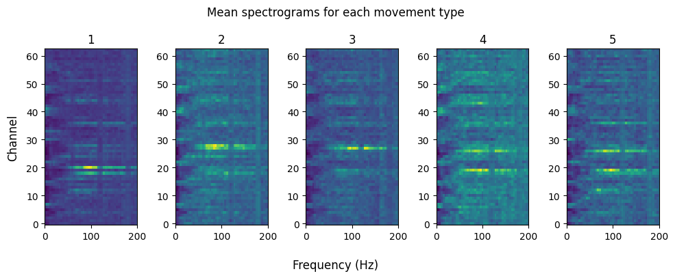
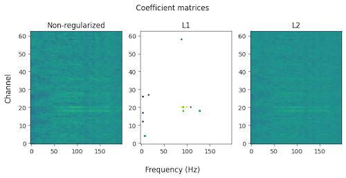

## Multiclass logistic decoders

Last week we ended with a PyTorch implementation of a multifeature logistic classifier. We were able to have it determine whether a thumb movement had been initiated based on the profile of spectral changes across multiple ECoG electrodes lying over motor cortex. Detecting whether a single movement occurred only requires a binary output, True or False. This is limited. Ideally our decoder would be able to read-out a variety of movements. This problem is known as *multinomial* or *multiclass classification*. For that, a set of features is given, just like before, and the probability of those features being associated with each of $K$ possibilities is returned.

This week we will explore how to extend our logistic decoder in Pytorch to achieve this. This will help us better understand the principles behind multiclass classification. Then, we will use the `LogisticRegression` class in Scikit Learn, which has multiclass classification built-in.

```{python}
import os.path as op
import numpy as np
import matplotlib.pyplot as plt
from sklearn.linear_model import LogisticRegression, LogisticRegressionCV
from sklearn.metrics import balanced_accuracy_score, confusion_matrix, ConfusionMatrixDisplay
from sklearn.model_selection import StratifiedKFold
from sklearn.decomposition import PCA
from IPython.display import HTML
import torch
from torch.utils.data import Dataset, DataLoader

import sys
sys.path.append('..')
from source.utils import zscore
from source.loaders import EcogFingerData
from source.decoders import LogRegPT, format_ecogfinger_data_spec

# Set random seeds for reproducibility
np.random.seed(1)
torch.manual_seed(2) #1
```

## Activity profiles for different finger movements

In the ECoG dataset we are working with, subjects were prompted to move each finger separately. Throughout the session, the ECoG was recorded from a grid of electrodes centered on the motor cortex. We detected the finger movements from sensors attached to the fingers and examined the corresponding spectral changes in brain activity on each electrode. On average, each finger movement was associated with a distinctive spectral profile across frequencies and channels.



We then trained a multifeature logistic decoder to use the pattern of spectral changes across electrodes to determine if a thumb movement was initiated or not. Half the trials given to it were the spectral changes associated with thumb movements, while the other half were periods approximately 1 second before a thumb movement, during which presumably no finger movements occurred. Not so surprisingly, the weights used in the decoder had a similar appearance to the spectral profile associated with the thumb movement, especially with L2 regularization.



Our logistic decoder only had one output that provided the probability of the thumb moving. If we want to decode multiple fingers, that requires a model with multiple outputs, one for each finger. If we know that only one finger (or no fingers) are moving at a time, then the problem is a *multiclass* classification problem where there are 6 outputs, one for each finger plus the no finger condition. For every sample only one of the outputs should have a value of 1, indicating that its corresponding finger was moved, or no finger was moved. This is the type of classifier we will end on.

Alternatively, we could just keep five outputs, one for each finger, and encode the absence of a finger movement as being when all outputs deliver a probability less than 0.5. This is known as a *multilabel* classifier, where for each sample we are attempting to predict the set of events that occurred. This approach would also be used if subjects had been allowed to move multiple fingers at once, requiring multiple outputs to register a finger movement.

Both of these are examples of multinomial decoders. We can use these to decode which finger was moved. To learn how to build such decoders, we will start with our original logistic decoder that we made in PyTorch and successively add features to it so that it behaves as a conventional multiclass decoder. The intermediate steps we take to this final outcome will each have problems. But, by implementing them, seeing how they fail, and fixing those failures, we will uncover how to properly construct a multinomial logistic decoder.

## Multiclass decoding, the wrong way

Let's start by loading in our data and importing our PyTorch based logistic decoder. We will use the PyTorch version because it allows us to directly implement changes required in making a multinomial logistic decoder.

```{python}
# select dataset
subj = 'cc'
ecog_path = ['data/ecog/', subj, '{}_fingerflex.mat'.format(subj)]
ecog_file = op.join(*ecog_path)

# load data
ecog_data = EcogFingerData(ecog_file)

# list of finger names
finger_names = ['thumb', 'index', 'middle', 'ring', 'little']
```

Much the same as the previous week, except now we will load in the spectrally processed ECoG samples from each finger movement. These will be pooled together into a dictionary to start.

```{python}
feats = {}
lbls = {}
for ind, finger in enumerate(finger_names):
    flex_times = ecog_data.detect_flex_onsets(finger)
    feats[finger], lbls[finger] = format_ecogfinger_data_spec(ecog_data, flex_times)
```

### Building a naive decoder

To build a simple multiclass decoder, we can try to pool together the results from decoders that were independently trained on each finger. Each is trained to detect whether a certain finger did or did not move. If all of them return a probability of finger movement less than 0.5, we will declare that no finger was moved. Otherwise, the detected finger will be assigned to the decoder the returns the highest probability for finger movement that is greater than 0.5.

When training each decoder we will use mostly standard settings, except for setting the L1 penalty to a value that encourages a sparse weight matrix. As covered last week, this tended to improve the performance of the decoder on the held out test data set by discouraging memorization of the training examples.

```{python}
# train a separate logistic regression model for each finger
lr_sgl = {}
print('Training individual models for each finger...')
print('Finger    Train     Test')
print('-------------------------')
for finger in finger_names:

    # initialize model
    lr_sgl[finger] = LogRegPT(lam=0.005, shuffle_seed=0)

    # fit model
    score_test, score_train = lr_sgl[finger].fit(feats[finger], lbls[finger])

    # print scores
    print('{:<10s}{:<10.0f}{:<10.0f}'.format(finger, score_train, score_test))
```

Fantastic performance on the training dataset, which isn't surprising. Performance on test sets was good as well. Not as good as the training, but that is to be expected. All decoders were able to classify correctly greater than 90% of the time between a movement or no movement of a given finger.

Let's now attempt to pool our decoders together to determine if a finger was moved, and if so which one. For this we will run each decoder on data from all fingers. We will construct an array of prediction probabilities, where each row is a different event (lift of a finger, or no finger movement), and each column is the probability returned for a different finger decoder. If for a given event all decoders return a probability less than 0.5, we will treat that as a no finger movement event. Otherise, we will assign the finger whose model returned the highest probability.

Before we do that, though, we need to pool our data together and get just those trials that were used for testing.

```{python}
# pool together all data
feats_all = np.concatenate([feats[finger] for finger in finger_names], axis=0)
lbls_all = np.concatenate([lbls[finger]*(i+1) for i,finger in enumerate(finger_names)], axis=0)

# extract those samples used for testing
idx_offset = 0
idx_test = []
for finger in finger_names:
    idx_test.append(idx_offset + lr_sgl[finger].test_idxs) # add offset to get global index
    idx_offset += len(lbls[finger]) # update offset
idx_test = np.concatenate(idx_test, axis=0)

# extract those samples used for training
feats_test = feats_all[idx_test]
lbls_test = lbls_all[idx_test]
```

```{python}
def lr_nv(feats):
    '''
    Predict finger flexion using naive multinomial logistic regression.
    Pools the out of multiple single logistic regression models.
    '''

    # get probability predictions for each finger decoder
    pred_prob = np.zeros((feats.shape[0], len(finger_names)))
    for ind, finger in enumerate(finger_names):
        pred_prob[:,ind] = lr_sgl[finger].predict_proba(feats)

    # get predicted labels
    # get maximum probability across fingers
    pred_max = np.max(pred_prob, axis=1)

    # find the finger with the maximum probability
    pred_lbls = np.argmax(pred_prob, axis=1)+1

    # if maximum predictions has probability less than 0.5 set to 0 (no finger)
    pred_lbls[pred_max < 0.5] = 0

    return pred_lbls

# predict labels for test data
lbls_pred_nv = lr_nv(feats_test)

# get test score
score = balanced_accuracy_score(lbls_test, lbls_pred_nv)
print('Test score: {:.0f}%'.format(score*100))
```

A performance of 79% is much lower than single finger classification, but not awful, especially considering that with 6 classes the chance level is \~16%.

Now we want to visualize the performance of our decoder. For that, we will use a confusion matrix. Recall that we used these in Week 3 for evaluating the performance of our ERP detector. In that case, we had two possible outcomes, Cue or No-cue. Here, we have 6 different outcomes: No finger flexion, thumb, index, middle, ring, or little finger flexion. For each event we have a *true label* that we know is correct, and a *predicted label* that is what our model claims was the case. Each row of the confusion matrix corresponds to a different true label, and each column to a predicted label. The value in each cell is the probability of the model returning a predicted label given that the event had a particular true label. This means that a model performing perfectly will show values of 1 along the diagonal of its confusion matrix, indicating that the true label and predicted label always agreed. If cells off the diagonal have probabilities greater than zero, then it means the model was wrong in its prediction (i.e. confused). Representing this as a matrix makes the nature of the errors more clear. For instance, it may be that a particular type of event has more errors, which would appear as an entire row with elevated probabilities. Or that a model is prone to erroneously predicting one type of event over another, which would manifest as a column of higher probabilties.

The SciKit learn package offers functions for computing and displaying confusion matrices, so let's avail ourselves of them to see how our finger decoder performs.

```{python}
# calculate confusion matrix
cm_nv = confusion_matrix(lbls_test, lbls_pred_nv, normalize='true') # normalize by true labels

# plot confusion matrix
cmd = ConfusionMatrixDisplay(cm_nv, display_labels=['no finger']+finger_names)
im = cmd.plot(cmap='Blues')
im.im_.set_clim(0,1)
plt.title('Confusion Matrix for Naive Logistic Regression')
```

Notice that the total probability for each row is 1, meaning that the values represent the probability of a predicted label ($\hat{y}$) given the true label ($y$), expressed as $p(\hat{y}|y)$. The most salient feature of the confusion matrix is that the highest probabilities tend to lie along the diagonal. This means our decoder is performing better than chance, but not perfectly. There are off-diagonal elements with non-zero probabilities, indicating incorrect classifications. This is especially the case for the little finger, who is frequently misclassified with the ring finger.

Why might this be so? Individually, each decoder had greater than 90% accuracy for whether a given finger had moved or not on the test data. However, this is a different problem then what we are asking now, which is for a decoder to distinguish between different fingers. If the middle and ring finger evoke similar patterns of ECoG activity, then a decoder will have trouble distinguishing them. This pattern is captured by the coefficients that our decoder uses. To see this, let's plot the coefficients used each decoder.

```{python}
# Get the coefficients from each decoder
coefs_nv = np.zeros((len(finger_names), feats_all.shape[1]))

for ind, finger in enumerate(finger_names):
    coefs_nv[ind,:] = lr_sgl[finger].get_coefs()[0]

# plot coefficients
fig, axs = plt.subplots(1, len(finger_names), figsize=(10,4))
for ind, finger in enumerate(finger_names):
    axs[ind].imshow(coefs_nv[ind,:].reshape((63,50)), cmap='bwr', norm=plt.Normalize(-0.1,0.1))
    axs[ind].set_title(finger)
    axs[ind].set_xticks([])
    axs[ind].set_yticks([])
    axs[ind].invert_yaxis()
fig.suptitle('Coefficients for each finger decoder')
fig.supxlabel('Frequency')
fig.supylabel('Channel')
fig.tight_layout()
```

We have extracted the coefficients from each decoder, reshaped them to reflect the channel by frequency organization of our features, and then plotted them for each finger. Red pixels have a positive weight, blue a negative, and white are at or near zero. The preponderance of zeros is because we used an L1 norm during the fitting.

The coefficient map for the thumb is radically different than the others, while the ring and little look more similar to each other compared with the rest. Indeed, looking back at the confusion matrix we can see that movement of the little finger had a 50% chance of being labeled as movement of the ring finger. To more precisely capture the degree of similarities between the coefficients, we can measure their correlation with each other.

```{python}
# plot correlation coefficients between each set of coefficients

def plot_coefcorr(coefs, finger_names, ax=None):
    '''
    Plot correlation coefficients between each set of coefficients
    '''

    if ax is None:
        fig, ax = plt.subplots()
    corr = np.corrcoef(coefs)
    im = ax.imshow(corr, cmap='bwr', norm=plt.Normalize(-0.5,0.5))
    plt.colorbar(im)
    ax.set_xticks(np.arange(len(finger_names)))
    ax.set_yticks(np.arange(len(finger_names)))
    ax.set_xticklabels(finger_names)
    ax.set_yticklabels(finger_names)
    ax.set_title('Correlation between finger coefficients')

plot_coefcorr(coefs_nv, finger_names)
fig.tight_layout()
```

This confirms our impression that the coefficients used to detect each finger are generally similar to each other, since they all show positive correlations with one another other. The coefficients used to detect thumb movement are most dissimilar to the others, and those for the ring and little finger are most alike. Because of this, the decoders will have trouble distinguishing between the movements of fingers, while still performing well when telling apart times when the finger was or was not moved.

To understand why the coefficients matter here, think back to the formula we used for our multifeature logistic regression: $$ \sigma(X)=\frac{1}{1+e^{-(b+WX)}} $$

Here $W$ is the vector of coefficients, and $X$ are the observed ECoG activity patterns. If the $W$ for the ring finger decoder is similar to the $W$ for the little finger decoder, than the two decoders will behave similarly and an ECoG pattern that would cause the detection of your little finger moving will also trigger a detection on the ring finger decoder. To visualize this, we can plot the distribution of $WX$ values for little and ring finger events, and compare those with no finger movement events. We will explore this using all the data, both training and testing, with the ring finger movement decoder coefficients.

We will also plot the decision line, where the logistic equation crosses 0.5 and an event is classified as ring finger movement. This will be when $WX=-b$, since $\frac{1}{1+e^0}=\frac{1}{1+1}=\frac{1}{2}$.

```{python}
# get finger indices and model parameters for ring finger decoder
ring_ind = finger_names.index('ring')
little_ind = finger_names.index('little')
ring_coefs = coefs_nv[ring_ind,:]
ring_intercept = lr_sgl['ring'].get_intercept()

# calculate the projection of the data onto the ring finger coefficients
r_r_vals = feats_all[lbls_all.squeeze()==ring_ind+1,:].dot(ring_coefs)
l_r_vals = feats_all[lbls_all.squeeze()==little_ind+1,:].dot(ring_coefs)
n_r_vals = feats_all[lbls_all.squeeze()==0,:].dot(ring_coefs)

# plot the projection of the data onto the ring finger coefficients
fig, ax = plt.subplots()
bins = np.linspace(-8,8,20)
ax.hist(r_r_vals, bins=bins, alpha=0.5, label='ring', density=True)
ax.hist(l_r_vals, bins=bins, alpha=0.5, label='little', density=True)
ax.hist(n_r_vals, bins=bins, alpha=0.5, label='no finger', density=True)
ax.axvline(-ring_intercept, color='k', linestyle='--', label='threshold')
ax.set_xlabel('$WX$')
ax.set_ylabel('Probability density')
ax.set_title('Projection of ECoG data onto ring finger coefficients')
ax.legend()
fig.tight_layout()
```

The ring finger movement decoder is good at detecting when the ring finger has moved, compared to when it has not. Most of the no finger events are below the threshold, while all the ring finger movement events are above threshold. However, the same is also true for the little finger movement events. This means our ring finger movement detector can also act as a little finger movement detector. The question now is whether there is enough difference in the ECoG activity between ring and little finger movements for a decoder to tell the difference between them.

One way to answer that question is to try to visualize the distribution of ring vs little finger ECoG patterns. This is challenging because each event is composed of several thousand data points, making the data exceedingly high dimensional. A trick then is to try to reduce the dimensionality of the data, to take those several thousand data points and distill them down to just a few. If we get it down to two, those can then be plotted on a scatter plot. The literature on dimensionality reduction (also called *embedding* or *manifold learning*) is vast and beyond this lecture. Instead we will try to use the projection onto the decoder coefficients. This time, instead of just projecting the data onto the ring finger decoder, we will also project them onto the little finger decoder. We can then plot those projections as a scatter plot.

```{python}
# get the projection of data onto the little finger coefficients
little_coefs = coefs_nv[little_ind,:]
little_intercept = lr_sgl['little'].get_intercept()
r_l_vals = feats_all[lbls_all.squeeze()==ring_ind+1,:].dot(little_coefs)
l_l_vals = feats_all[lbls_all.squeeze()==little_ind+1,:].dot(little_coefs)
n_l_vals = feats_all[lbls_all.squeeze()==0,:].dot(little_coefs)

# plot the projection of the data onto both sets of coefficients
fig, ax = plt.subplots()
ax.scatter(r_r_vals, r_l_vals, label='ring', alpha=0.5)
ax.scatter(l_r_vals, l_l_vals, label='little', alpha=0.5)
ax.scatter(n_r_vals, n_l_vals, label='no finger', alpha=0.5)
ax.axvline(-ring_intercept, color='tab:blue', linestyle='--', label='ring threshold')
ax.axhline(-little_intercept, color='tab:orange', linestyle='--', label='little threshold')
ax.set_xlabel('$WX$ (ring)')
ax.set_ylabel('$WX$ (little)')
ax.set_title('Projection of ECoG data onto ring and little finger coefficients')
ax.legend()
fig.tight_layout()
```

Most of the data points lie along a diagonal, indicating that coefficients of each model tend to transform the data similarly. As before, the greater segregation of events is between finger movement and no movement events, here shown as blue and orange data points exclusively above the thresholds, and green no movement data points mostly below the thresholds. Crucially, focusing on the ring and little finger event data points, we can see that they do not perfectly overlap. The ring finger movement data points tend to be offset from the little finger data points. That difference was not trained for, but this indicates that the ECoG patterns evoked by these events might be distinct enough to discriminate them. What we need to do now is train a decoder to do so.

What does this look like if we compare two fingers who were never confused? Let's create the same plot, but for thumb and middle finger.

```{python}
# get finger indices and model parameters for ring finger decoder
thumb_ind = finger_names.index('thumb')
middle_ind = finger_names.index('middle')
thumb_coefs = coefs_nv[thumb_ind,:]
thumb_intercept = lr_sgl['thumb'].get_intercept()
middle_coefs = coefs_nv[middle_ind,:]
middle_intercept = lr_sgl['middle'].get_intercept()

# calculate the projection of the data onto the thumb finger coefficients
m_t_vals = feats_all[lbls_all.squeeze()==middle_ind+1,:].dot(thumb_coefs)
t_t_vals = feats_all[lbls_all.squeeze()==thumb_ind+1,:].dot(thumb_coefs)
n_t_vals = feats_all[lbls_all.squeeze()==0,:].dot(thumb_coefs)

# calculate the projection of the thumb onto the middle finger coefficients
m_m_vals = feats_all[lbls_all.squeeze()==middle_ind+1,:].dot(middle_coefs)
t_m_vals = feats_all[lbls_all.squeeze()==thumb_ind+1,:].dot(middle_coefs)
n_m_vals = feats_all[lbls_all.squeeze()==0,:].dot(middle_coefs)

# plot the projection of the data onto both sets of coefficients
fig, ax = plt.subplots()
ax.scatter(m_m_vals, m_t_vals, label='middle', alpha=0.5)
ax.scatter(t_m_vals, t_t_vals, label='thumb', alpha=0.5)
ax.scatter(n_m_vals, n_t_vals, label='no finger', alpha=0.5)
ax.axvline(-middle_intercept, color='tab:blue', linestyle='--', label='middle threshold')
ax.axhline(-thumb_intercept, color='tab:orange', linestyle='--', label='thumb threshold')
ax.set_xlabel('$WX$ (middle)')
ax.set_ylabel('$WX$ (thumb)')
ax.set_title('Projection of ECoG data onto middle and thumb finger coefficients')
ax.legend()
fig.tight_layout()
```

The patterns associated with thumb and middle finger movements are more separable. One could envision drawing a line between their two distributions of points such that all the thumb events lie on one side, and all the ring events on the other. This gives us hope that training a decoder to use this difference might improve our ability to detect individual finger movements.

### One versus rest multiclass decoder

If we wanted to construct a general decoder of finger movements, we could train a logistic decoder for each possible pair of finger movements: thumb vs. index, ring vs. little, etc. The number of possible pairs for $K$ classes of events is $K(K-1)/2$. In our case of five fingers, that would be $5(5-1)/2=20/2=10$. If we were to then run each of these ten decoders, we would predict that the finger who won out across the most of them is the finger that was moved. This is known as a *one versus one* (OvO) decoder.

We will not use that strategy. Instead, we will experiment with a *one versus rest* approach (OvR, and sometimes referred to as 'one versus all'). In OvR, you train N decoders that each must discriminate between a specific event and all other events, e.g. thumb versus index or middle or ring or little. The decoder that returns the largest probability is the one that is associated with the finger moving. Conveniently, this only requires a simple change to our existing logistic decoder.

To refresh our memory, originally our logistic decoder worked this way: It received a sample as a vector $$ 
samp  = 
\begin{bmatrix}
1 & f_{1,1} & f_{1,2} & \cdots & f_{ch,freq} \\
\end{bmatrix}
$$ with the 1 prepended for the intercept, and each feature the spectral power at a specific channel ($ch$) and frequency ($freq$). The decoder had an intercept and weight parameters, like so: $$
w  = 
\begin{bmatrix}
b \\
w_{1,1} \\
w_{1,2} \\ 
\vdots \\ 
w_{ch,freq} \\
\end{bmatrix}
$$

If we vertically concatenate each of the sample vectors, we can multiply them by $w$ and get a new vector where each element is proportional to the probability that a finger movement occurred.

$$
\begin{bmatrix}
\text{---} & samp_{1} & \text{---} \\
\text{---} & samp_{2} & \text{---} \\
    & \vdots &   \\
\text{---} & samp_{N} & \text{---} \\
\end{bmatrix}
\begin{bmatrix}
b \\
w_{1,1} \\
w_{1,2} \\ 
\vdots \\ 
w_{ch,freq} \\
\end{bmatrix}
=
\begin{bmatrix}
z_1 \\
z_2 \\
\vdots \\
z_N \\
\end{bmatrix}
$$

Then, each result $z_i$ is passed through the sigmoid function $$ \sigma(z_i) = \frac{1}{1+e^{-z_i}} $$ and if that was above 0.5 we decide that a finger movement had occurred on $samp_i$.

To evaluate multiple decoders simultaneously, we turn our weight vector into a matrix, where each column is associated with a logistic regression for a specific finger.

\begin{bmatrix}
\color{yellow}\text{---} & \color{yellow}samp_{1} & \color{yellow}\text{---} \\
\text{---} & samp_{2} & \text{---} \\
    & \vdots &   \\
\text{---} & samp_{N} & \text{---} \\
\end{bmatrix}
\begin{bmatrix}
\color{blue}\vert & \vert & \vert & \vert & \vert \\
\color{blue}w_{t} & w_{i} & w_{m}& w_{r}& w_{l} \\
\color{blue}\vert & \vert & \vert & \vert & \vert \\
\end{bmatrix}

=

\begin{bmatrix}
\color{green}z_{1,t} & \color{yellow}z_{1,i} & \color{yellow}z_{1,m} & \color{yellow}z_{1,r} & \color{yellow}z_{1,l} \\
\color{blue}z_{2,t} & z_{2,i} & z_{2,m} & z_{2,r} & z_{2,l} \\
    &   &  \vdots &  & \\
\color{blue}z_{N,t} & z_{N,i} & z_{N,m} & z_{N,r} & z_{N,l} \\
\end{bmatrix}

For clarity, sample one is highlighted in yellow, and the weights associated with the thumb decoder are in blue. When these two matrices are multiplied together, we get a new matrix of $z$ values, where samples are on the row axis and finger decoders are on the column axis. The green cell is the $z$ value for the thumb decoder on the first sample.

Put more concisely, $SW=Z$. To determine which finger was raised, will apply the sigmoid transform to $Z$ for each row we identify the column (finger) with the largest probability. This can be expressed with the argmax function:

$$ 
pred_{i} = \underset{f=fingers}{\text{argmax}}\ \sigma(z_{i,f})
$$

The only major effect this will have on our training is that instead of our algorithm trying to fit a decoder between finger movement and no movement, it will instead optimize for the difference between moving a specific finger and all other fingers. During the fitting, the coefficients will update the same, since the loss will be propagated back through each column in matrix W independently. In addition, we will add an additional output (logistic decoder) for the no finger condition, which will have its own weights and intercept.

To implement this, we will modify our existing `LogRegPT` class. There are only a few spots we have to change. First, we need to change the Linear layer in our logistic regression model to now have 6 outputs, instead of the original one. Two, the `loss` method has to be modified to accept the 6 outputs instead of just one (more on this below). Lastly, the `predict` method needs to convert the 6 outputs of the network to labels by identifying which has the highest probability for each sample.

```{python}
class LogRegPTOvR(LogRegPT):

    def _create_model(self):


        # layer where regularization is applied
        self.reg_layer = 0

        # input size is the number of features
        input_size = self._X_shape[1]

        # linear layer is the weights and bias
        # input_dim is the number of input features and 6 is the number of output classes (5 fingers + no finger)
        # this is taking the matrix multiplication of the input features with the weights and adding the bias
        lin_layer = torch.nn.Linear(input_size, self._n_classes) # <--- CHANGED HERE, 6 is the number of output classes

        # sigmoid layer is the activation function
        sig_layer = torch.nn.Sigmoid()

        # logistic regression model is a sequential combination of linear and sigmoid layers
        model = torch.nn.Sequential(
            lin_layer,
            sig_layer
        )
        self._model = model

    def _loss(self, pred, lbl):
        # Parameters
        # ----------
        # pred : array-like
        #     Predicted probability of each sample being in class 1
        # lbl : array-like
        #     Array of labels, where each element is the label for the corresponding row in X

        # Returns
        # -------
        # loss : float
        #     Loss value

        loss_fn = torch.nn.BCELoss(reduction='mean')

        # convert integer labels to one-hot encoding
        # set tensor lbl to be an integer tensor
        lbl = lbl.type(torch.int64) # <--- CHANGED HERE, formatted to int to act as index tensor
        lbl = torch.nn.functional.one_hot(lbl.squeeze(), num_classes=6) # <--- CHANGED HERE, 6 is the number of output classes
        lbl = lbl.type(torch.float32)  # <--- CHANGED HERE, formatted to float for loss function

        # calculate loss
        loss = loss_fn(pred, lbl)
        #loss += self.lam*torch.sum(torch.abs(self._logreg[0].weight)) # add L1 regularization

        return loss

    def predict(self, X):
        # Parameters
        # ----------
        # X : array-like
        #     Array of features, where each row is a trial and each column is a feature

        # Returns
        # -------
        # pred : array-like
        #     Predicted labels

        if self._model is None:
            raise ValueError('Logistic regression model has not been fit yet.')
        
        self._model.eval()

        X = torch.tensor(X.astype(np.float32))
        
        with torch.no_grad():
            pred = self._model(X)
            pred = pred.squeeze().numpy()
            pred_lbls = np.argmax(pred, axis=1) # <--- CHANGED HERE, convert to label

        return pred_lbls
```

Looking over this code, you will notice that the term *one-hot* is used. This refers to a way to encode the classes. Originally when we trained single logistic decoders we encoded whether a finger moved or not as a binary variable, 0 or 1, at each sample. When we pooled the decoders together, we needed a way to label each finger uniquely (they can't all be 1). To do this, we did thumb = 1, index = 2, middle = 3, ring = 4, little = 5, and no finger movement = 0. Now that we are training 6 decoders in parallel, our output is 6 probabilities, and the target output will be a vector of length 6, with one entry for each finger (or no finger). When a finger is moved, its value is set to 1, and all others are set to 0. This is where the term one-hot comes from; only one entry in the vector is set to 1, and all the other are 0. Let's visualize this:

```{python}
# adding in the no finger condition
mult_lbls = ['no finger'] + finger_names

# create one-hot finger labels
lbls_all_oh= np.zeros((lbls_all.shape[0], len(mult_lbls)))
for ind, finger in enumerate(mult_lbls):
    lbls_all_oh[lbls_all.squeeze()==ind, ind] = 1


# plot the one-hot labels
fig, axs = plt.subplots(1,2, figsize=(6,3))
im = axs[0].imshow(lbls_all[:,np.newaxis], aspect=0.025, interpolation='none')
axs[0].set_title('Original labels')
axs[0].set_ylabel('Trial')
axs[0].set_xticks([])
cbar = fig.colorbar(im, ax=axs[0], ticks=np.arange(len(mult_lbls)))
cbar.ax.set_yticklabels(mult_lbls)
cbar.ax.invert_yaxis()

im = axs[1].imshow(lbls_all_oh, aspect='auto', cmap='gray_r', interpolation='none')
axs[1].set_title('One-hot coded labels')
axs[1].set_ylabel('Trial')
axs[1].set_xlabel('Finger')
axs[1].set_xticks(np.arange(len(mult_lbls)))
axs[1].set_xticklabels(mult_lbls, rotation=45, ha='right')
cbar = fig.colorbar(im, ax=axs[1], ticks=[0,1])
fig.tight_layout()
```

The target labels have been transformed from a list of integers to a binary matrix. For the one-hot coded matrix each row is a sample and each column a type of event. Here, the value in the first column is a 1 if no finger movement occurred, and then each of the fingers is assigned its own column. Note that the changes we made to our logistic regression class allow us to keep passing the integer coded label list as the `y` input. All the one-hot conversions are done internally in the `predict` and `loss` methods.

There is one other thing we have to do to the training data before passing it to the decoder's `fit` method. Looking at the one-hot coded labels matrix, we can see that there are approximately 5 times as many no finger conditions as there are conditions for each finger. This is because we just pooled together all the training data we used for each of the single decoders, which were each trained on a dataset containing equal numbers of movement and no movement trials. By pooling, we have created an unbalanced dataset with an over representation of no finger trials. This could bias the training to optimize for detecting no finger movement events, at the expense of improved discrimination between different finger movements. So before we train, we remove enough no-finger trials to balance the dataset.

```{python}
# keep a random subset of no finger trials equal in number to the number of individual finger trials

# get the median number of labels for each finger
n_lbls = np.median(np.bincount(lbls_all.squeeze().astype(int))).astype(int)

# get the indices of the no finger trials
no_finger_inds = np.where(lbls_all==0)[0]

# randomly select a subset of no finger trials to keep, equal in number to the median number of labels for each finger
no_finger_inds = np.random.choice(no_finger_inds, size=n_lbls, replace=False)

# keep the selected no finger trials and all of the individual finger trials
inds = np.concatenate([no_finger_inds, np.where(lbls_all)[0]])
feats_sub = feats_all[inds,:]
lbls_sub = lbls_all[inds]
```

Now that the data is balanced, let's train!

```{python}
lr_ovr = LogRegPTOvR(lam=0.005, shuffle_seed=0)
test_score, train_score = lr_ovr.fit(feats_sub, lbls_sub)
print('Training score: {:.0f}%'.format(train_score))
print('Test score: {:.0f}%'.format(test_score))
```

Whoa, 82% is a far fall from 98%, but it is better than the 79% performance with our naive decoder.

To diagnose where things are going wrong, let's use the confusion matrix. We can compare it with the original confusion matrix from our naive decoder to see if the types of errors being made have changed. As before, we will restrict our analysis to the test trials, which we extract from our logistic decoder object.

```{python}
test_idxs = lr_ovr.test_idxs

# evaluate decoder performance using confusion matrix
lbls_pred_test = lr_ovr.predict(feats_sub[test_idxs,:])
lbls_true_test = lbls_sub[test_idxs]
cm_ovr = confusion_matrix(lbls_true_test, lbls_pred_test, normalize='true')

fig, ax = plt.subplots(1,2, figsize=(10,4))
cmd = ConfusionMatrixDisplay(cm_nv, display_labels=mult_lbls)
im = cmd.plot(cmap='Blues', ax=ax[0])
im.im_.set_clim(0,1)
im.ax_.set_title('Confusion matrix for naive decoder')

cmd = ConfusionMatrixDisplay(cm_ovr, display_labels=mult_lbls)
im = cmd.plot(cmap='Blues', ax=ax[1])
im.im_.set_clim(0,1)
im.ax_.set_title('Confusion matrix for OvR decoder')

fig.tight_layout()
```

Notice how the diagonal elements on the OvR confusion matrix tend to have higher probabilities now, this indicates that correct classifications have increased. Correspondingly, many of the off-diagonal elements have been reduced to zero, which means we have fewer misclassifications. Performance for no finger and index have improved, which makes sense since the patterns of neural activity associated with them are quite different from the others. Index and middle fingers are much less confused. However, correct classifications for the ring finger have gotten dramatically worse.

Given that the performance of each decoder depends on their weights, these should be different from the naive case.

```{python}
# Get the coefficients from each decoder
coefs_ovr = lr_ovr.get_coefs()[0]


# plot coefficients
fig, axs = plt.subplots(2, len(mult_lbls), figsize=(10,5))
for ind, finger in enumerate(mult_lbls):
    if finger == 'no finger':
        axs[0,ind].imshow(np.zeros((63,50)), cmap='bwr', 
                          norm=plt.Normalize(-0.1,0.1), interpolation='none')
        axs[0,ind].set_title(finger)
        axs[0,ind].set_xticks([])
        axs[0,ind].set_yticks([])
    else:
        axs[0,ind].imshow(coefs_nv[ind-1,:].reshape((63,50)), cmap='bwr', 
                          norm=plt.Normalize(-0.1,0.1), interpolation='none')
        axs[0,ind].set_title(finger)
        axs[0,ind].set_xticks([])
        axs[0,ind].set_yticks([])

    
    axs[1,ind].imshow(coefs_ovr[ind,:].reshape((63,50)), cmap='bwr', 
                      norm=plt.Normalize(-0.1,0.1), interpolation='none')
    axs[1,ind].set_xticks([])
    axs[1,ind].set_yticks([])

    axs[0,ind].invert_yaxis()
    axs[1,ind].invert_yaxis()
    
    if ind == 0:
        axs[0,ind].set_ylabel('Naive decoder')
        axs[1,ind].set_ylabel('OvR decoder')

fig.suptitle('Coefficients for each finger decoder')
fig.supxlabel('Frequency')
fig.supylabel('Channel')
fig.tight_layout()
```

For our naive decoder we only had 5 sets of weights, one for each finger. Now we have six with the no finger decoder added. Using the OvR strategy radically changed the weights our model learned. The naive decoder, where each finger was trained separately, had the strongest weights as positive values at gamma frequencies and localized to several channels that were common across all the fingers (except for the thumb). This is because each decoder is separating the no finger condition from the finger movement condition, and for many of the fingers the same channels are activated.

The OvR decoder, on the other hand, is mostly composed of negative weights. The no finger decoder is composed of negative weights largely on the channels that indicated finger movements by the naive decoder. By doing this, the logistic function will be decoding the **absence** of a finger movement. This can be imagined as taking the average weights of the finger decoders from the naive, and then negating them to have the decoder give a high probability for samples where no finger movement was present. Dramatic changes were also present for the decoders of individual finger movements. The fingers now have a mixture of positive and negative weights, each on a different subset of channels. These weights reflect the patterns of activities that are distinct between both the no finger and each of the other fingers.

How did these changes in weights affect how samples are projected?

```{python}
def plot_finger_projections(finger1, finger2, lbls_list, coef_tensor, feats, lbls, ax=None):

    if ax is None:
        fig, ax = plt.subplots()
    finger1_ind = lbls_list.index(finger1)
    finger2_ind = lbls_list.index(finger2)
    
    finger1_coefs = coef_tensor[finger1_ind,:]
    finger2_coefs = coef_tensor[finger2_ind,:]

    # calculate the projection of the data onto the finger1 coefficients
    n_f1_vals = feats[lbls.squeeze()==0,:].dot(finger1_coefs)
    f1_f1_vals = feats[lbls.squeeze()==finger1_ind,:].dot(finger1_coefs)
    f2_f1_vals = feats[lbls.squeeze()==finger2_ind,:].dot(finger1_coefs)

    # get the projection of the data onto the finger2 coefficients
    n_f2_vals = feats[lbls.squeeze()==0,:].dot(finger2_coefs)
    f1_f2_vals = feats[lbls.squeeze()==finger1_ind,:].dot(finger2_coefs)
    f2_f2_vals = feats[lbls.squeeze()==finger2_ind,:].dot(finger2_coefs)

    # plot the projection of the data onto both sets of coefficients
    ax.scatter(f1_f1_vals, f1_f2_vals, label=finger1, alpha=0.5)
    ax.scatter(f2_f1_vals, f2_f2_vals, label=finger2, alpha=0.5)
    ax.scatter(n_f1_vals, n_f2_vals, label='no finger', alpha=0.5)
    ax.set_xlabel(f'$WX$ ({finger1})')
    ax.set_ylabel(f'$WX$ ({finger2})')
    ax.set_title(f'Projection of ECoG data \n onto {finger1} and {finger2} coefficients')
    ax.legend()
    # for the grid, add thick lines at origin
    ax.grid(which='major')

plot_finger_projections('thumb', 'little', mult_lbls, coefs_ovr, feats_sub, lbls_sub)
```

The distribution of points is now quite different from what we saw with the naive training strategy. In that case, thumb and little finger trials tended to project similarly, scattering in the same region that lay opposite those for no finger trials. Now, they lie on opposing ends of the no finger distribution. This happens because the OvR training strategy encourages the weights for each condition to provide maximal separation from all other conditions, and not just from the no finger condition. For some pairs of fingers with very different neural activation profiles, such as thumb and little finger, this results in perfect separation between them. Other pairs, however, may not divide as cleanly if their activations are too similar. We can see this when comparing middle vs. index or ring vs. little:

```{python}
fig, ax = plt.subplots(1,2, figsize=(10,4))
plot_finger_projections('index', 'middle', mult_lbls, coefs_ovr, feats_sub, lbls_sub, ax=ax[0])
plot_finger_projections('ring', 'little', mult_lbls, coefs_ovr, feats_sub, lbls_sub, ax=ax[1])
fig.tight_layout()
```

Here we see that the points for index and middle finger samples are better separated than those between ring and little. This agrees with the pattern of classifications seen in the confusion matrix, where index and middle showed no incorrect classifications between, while such mistakes dominated for ring and little finger trials.

Importantly, we still see the general pattern where the distribution of points for each finger lies on the opposite side of the no-finger distribution. Thus, an OvR strategy improves decoding by encouraging the weights for each decoder to separate from the other ones.

To project the finger trials into counterposed domains, the weights seem to be taking on negative values for those channels and frequencies where the fingers evoked common activations. Positive weights are found where the fingers differed from each other. This should cause the weights associated with each finger to be less, or even negatively correlated with each other. To see if this is the case, let's plot the correlation matrix of the weight vectors.

```{python}
fig, ax = plt.subplots(1,2, figsize=(10,4))
plot_coefcorr(coefs_nv, finger_names, ax=ax[0])
plot_coefcorr(coefs_ovr, mult_lbls, ax=ax[1])
ax[0].set_title('Naive decoder\nCorrelation between finger coefficients')
ax[1].set_title('OvR decoder\nCorrelation between finger coefficients')
fig.tight_layout()
```

As suspected, the OvR decoder drove the weights towards being less or even negatively correlated.

### Softmax activation to fix probabilities

So far we have just chosen the decoder with the highest probability to indicate which finger (or no finger) was moved. For this task, at each moment in time, only one finger can be moving, so the probabilities returned by our model should add up to 1. Is this the case? Our decoder provides a `predict_proba` method similar to what is found in scikit-learn classifiers. This returns the probability assigned by the model for each finger. We can use this function to determine whether the probabilities are behaving correctly and adding up to 1 for each sample.

```{python}
def print_prob_tbl(lr):

    idxs = lr.test_idxs
    # get probability predictions for each finger decoder
    pred_prob = lr.predict_proba(feats_sub[idxs,:])

    # get the first 10 trials
    print_idxs = np.random.choice(pred_prob.shape[0], size=10, replace=False)
    pred_prob = pred_prob[print_idxs,:]

    # get the sum of the probabilities across fingers
    pred_prob_sum = np.sum(pred_prob, axis=1)

    # true label
    lbls_tbl = lbls_sub[idxs]
    lbls_tbl = lbls_tbl[print_idxs]

    # print the table header
    for lbl in mult_lbls:
        print('{:<10s}'.format(lbl), end='')
    print('{:<10s}'.format('Sum'))

    # print the table rows
    for ind in range(10):
        # color the true label red
        for ind2 in range(len(mult_lbls)):
            if ind2 == lbls_tbl[ind]:
                print('>{:<9.2f}'.format(pred_prob[ind,ind2]), end='')
            else:
                print('{:<10.2f}'.format(pred_prob[ind,ind2]), end='')
        print('{:<10.2f}'.format(pred_prob_sum[ind]))

print_prob_tbl(lr_ovr)
```

This table reveals that in general, the correct class (highlighted) has the highest probability, but the sum of the probabilities across all classes is never 1. This makes our decoder effective at predicting which finger was moved, but not at assigning a meaningful probability to that prediction.

What we need is a way to ensure that the sum of the outputs from the decoder equals 1. To do this, we will replace the sigmoid function with the *softmax function*. Just as the sigmoid function ensured that a single output would obey the properties of a probability value - constraining it to be between 0 and 1 - the softmax does the same for multiple outputs. It is:

$$ 
\sigma(Z)_i = \frac{e^{z_i}}{\sum_{j=1}^N{e^{z_j}}}
$$

The exponentiation ensures that the outputs of our linear layer are kept positive, which means we will never go below 0. Then, dividing by the sum of all the exponentiated class outputs, we force the total probability to be 1.

To code the softmax function, you would:

```{python}
def softmax(x):
    # Parameters
    # ----------
    # x : array-like
    #     Array of values

    # Returns
    # -------
    # x : array-like
    #     Array of values after softmax transformation

    return np.exp(x)/np.sum(np.exp(x))
```

Let's now get a feel for how it behaves by passing a few different types of inputs to it.

```{python}
inp1 = np.array([1,2,3])
inp2 = np.array([1,2,3,4])
inp3 = np.array([1,2,3,4,5])

print('Softmax of [1,2,3]: {}'.format(softmax(inp1)))
print('Softmax of [1,2,3,4]: {}'.format(softmax(inp2)))
print('Softmax of [1,2,3,4,5]: {}'.format(softmax(inp3)))
```

The probability assigned to each input grows with its relative value. The smallest input has the smallest probability and the largest input has the largest probability. The probabilities also tend to shrink as the number of inputs increase. It is also the case that even though our inputs each have a difference of 1, their assigned probabilities grow exponentially the larger they are. Let's try some more inputs.

```{python}
inp4 = inp1 - 2
inp5 = inp1 + 2

print('Softmax of [-1,0,1]: {}'.format(softmax(inp4)))
print('Softmax of [3,4,5]: {}'.format(softmax(inp5)))
```

Here we can see that even when we give negative values, the probability returned is kept bounded between 0 and 1. In addition, shifting all our values by a constant amount does not change the returned probabilities. This is a simple consequence of how exponentials work:

$$
\begin{align}
\sigma(c+Z)_i &= \frac{e^{c+z_i}}{\sum_{j=1}^N{e^{c+z_j}}} \notag \\
             &= \frac{e^{c}e^{z_i}}{\sum_{j=1}^N{e^{c}e^{z_j}}} \notag \\
             &= \frac{e^{c}e^{z_i}}{e^{c}\sum_{j=1}^N{e^{z_j}}} \notag \\
             &= \frac{\cancel{e^{c}}e^{z_i}}{\cancel{e^{c}}\sum_{j=1}^N{e^{z_j}}} \notag \\
             &= \frac{e^{z_i}}{\sum_{j=1}^N{e^{z_j}}} \notag
\end{align}
$$

::: callout-note
## How the cross-entropy function relates to softmax

The cross entropy function is:

$$ CE(\hat{y},y) = -\sum_{i=1}^k y \log(\hat{y}) $$

where $\hat{y}$ is the predicted probability and $y$ is the actual probability. Note, this is a generalization of the binary cross entropy function, since, if we treat $y$ as just the probability of a binary outcome:

$$ p(y|\hat{y})=\begin{cases}
    \hat{y} & y=1 \\
    1-\hat{y} & y=0
    \end{cases}
$$

then

$$ \begin{align}
    CE(\hat{y},y) &= -\sum_{i=1}^k y \log(\hat{y}) \notag \\
                   &= -(y \log(\hat{y}) + (1-y) \log(1-\hat{y})) \notag \\
                   &=  -y \log(\hat{y}) - (1-y) \log(1-\hat{y}) \notag \\
    \end{align}
$$

where the last equation is the binary cross entropy loss.

When applying the cross entropy function to the softmax, creating our loss function, we get:

$$ \begin{align}
L &= -\log{\frac{e^{z_i}}{\sum_{j=0}^{k}e^{z_j}}} \notag \\
&= -z_i + log\sum_{j=0}^{k}e^{z_j} \notag\\
\end{align}
$$
:::

The softmax function is used at the output layer when performing multiclass decoding, and PyTorch includes it in the library. So we will now create a third version of our decoder, creating a subclass of our `LogRetPTOvR` logistic decoder. This entails a few changes. In the `loss` method we will remove the `BCELoss` function and replace it with the `CrossEntropyLoss` function, which includes a numerically stable softmax function. Since softmax is built into the loss and is the multiple output generalization of the sigmoid, we have to remove the sigmoid layer from our `_logreg` network. Removing that transformation from the output layer will not affect which class is predicted when we call the `predict` method since the softmax transform is monotonic, meaning that output with the largest probability would also have the largest value before softmax is applied. But, if we want to return the correct probability for each class, then we do have to add the softmax function to the `predict_proba` method. Otherwise, it would just return the output of the linear layer, which is sometimes referred to as 'logits' ($exp(log(z))=z$).

```{python}
class LogRegPTSM(LogRegPTOvR):

    def _create_model(self):
        
        # layer where regularization is applied
        self.reg_layer = 0

        # input size is the number of features
        input_size = self._X_shape[1]

        # linear layer is the weights and bias
        # input_dim is the number of input features and 6 is the number of output classes (5 fingers + no finger)
        # this is taking the matrix multiplication of the input features with the weights and adding the bias
        lin_layer = torch.nn.Linear(input_size, self._n_classes) # <--- CHANGED HERE, 6 is the number of output classes
        
        # sigmoid layer is the activation function
        # sig_layer = torch.nn.Sigmoid() <--- CHANGED HERE, removed sigmoid layer, softmax is built into cross entropy loss

        # logistic regression model is a sequential combination of linear and sigmoid layers
        model = torch.nn.Sequential(
            lin_layer,
        #    sig_layer <--- CHANGED HERE, removed sigmoid layer, softmax is built into cross entropy loss
        )
        self._model = model

    def _loss(self, pred, lbl):
        # Parameters
        # ----------
        # pred : array-like
        #     Predicted probability of each sample being in class 1
        # lbl : array-like
        #     Array of labels, where each element is the label for the corresponding row in X

        # Returns
        # -------
        # loss : float
        #     Loss value

        loss_fn = torch.nn.CrossEntropyLoss(reduction='mean') # <--- CHANGED HERE, cross entropy loss, has softmax built in

        # convert integer labels to one-hot encoding
        # set tensor lbl to be an integer tensor
        lbl = lbl.type(torch.int64)
        lbl = torch.nn.functional.one_hot(lbl.squeeze(), num_classes=self._n_classes)
        lbl = lbl.type(torch.float32)

        # calculate loss
        loss = loss_fn(pred, lbl)

        return loss

    def predict_proba(self, X):
        # Parameters
        # ----------
        # X : array-like
        #     Array of features, where each row is a trial and each column is a feature

        # Returns
        # -------
        # pred : array-like
        #     Predicted probability of each sample being in class 1

        if self._model is None:
            raise ValueError('Logistic regression model has not been fit yet.')
        
        self._model.eval()

        X = torch.tensor(X.astype(np.float32))
        
        with torch.no_grad():
            pred = self._model(X)
            pred = torch.nn.functional.softmax(pred, dim=1) # <--- CHANGED HERE, softmax activation function added since it is not built into the model
            pred = pred.squeeze().numpy()

        return pred
```

This new version of the multiclass logistic decoder now accounts for all the issues we could think of. Let's see how well it works.

```{python}
lr_sm = LogRegPTSM(lam=0.005, shuffle_seed=0) # use all data for training
test_score, train_score = lr_sm.fit(feats_sub, lbls_sub)
print('Training score: {:.0f}%'.format(train_score))
print('Test score: {:.0f}%'.format(test_score))
```

Not bad. Including the softmax at the output stage raised the accuracy from 82 to 85%. But it is not immediately clear why, since all we did was ensure that the returned probabilities behave appropriately. Indeed, it could just be due to chance since randomization is part of the data shuffling and optimization process. Nevertheless, we can examine how the softmax version of our decoder is solving the classification problem.

First, let's examine the probabilities returned to make sure they are correct.

```{python}
print_prob_tbl(lr_sm)
```

Looks great. For each sample the probabilities sum to 1, and often the correct event has the highest probability. Note also that the distribution of probabilities is different now. The largest ones for each sample tend to be much higher, and the incorrect events are seemingly pushed towards 0. This stems from the exponentiation performed on the $z$ values returned by the linear layer.

Since the performance was modestly better, we can see what was driving that by examining the confusion matrix.

```{python}
test_idxs = lr_sm.test_idxs

# evaluate decoder performance using confusion matrix
flex_lbls_pred_test = lr_sm.predict(feats_sub[test_idxs,:])
flex_lbls_true_test = lbls_sub[test_idxs]
cm_sm = confusion_matrix(flex_lbls_true_test, flex_lbls_pred_test, normalize='true')

fig, ax = plt.subplots(1,3, figsize=(15,4))
cmd = ConfusionMatrixDisplay(cm_nv, display_labels=mult_lbls)
im = cmd.plot(cmap='Blues', ax=ax[0])
im.im_.set_clim(0,1)
im.ax_.set_title('Confusion matrix for naive decoder')

cmd = ConfusionMatrixDisplay(cm_ovr, display_labels=mult_lbls)
im = cmd.plot(cmap='Blues', ax=ax[1])
im.im_.set_clim(0,1)
im.ax_.set_title('Confusion matrix for OvR decoder')

cmd = ConfusionMatrixDisplay(cm_sm, display_labels=mult_lbls)
im = cmd.plot(cmap='Blues', ax=ax[2])
im.im_.set_clim(0,1)
im.ax_.set_title('Confusion matrix for softmax decoder')

fig.tight_layout()
```

The improved performance seems to have only arrived by improving the decoding of the ring finger. Previously, the OvR decoder was prone to attributing ring finger samples to other fingers, or no finger movement at all. Now, it doesn't do that as much. Given this, we might be tempted to conclude that the weights for the ring finger have changed.

Visualizing the weights will help us see how this refined performance occurred.

```{python}
# Get the coefficients from each decoder
coefs_sm = lr_sm.get_coefs()[0]

# plot coefficients
fig, axs = plt.subplots(3, len(mult_lbls), figsize=(9,6))
for ind, finger in enumerate(mult_lbls):
    if finger == 'no finger':
        axs[0,ind].imshow(np.zeros((63,50)), cmap='bwr', norm=plt.Normalize(-0.1,0.1), interpolation='none')
        axs[0,ind].set_title(finger)
        axs[0,ind].set_xticks([])
        axs[0,ind].set_yticks([])
    else:
        axs[0,ind].imshow(coefs_nv[ind-1,:].reshape((63,50)), cmap='bwr', norm=plt.Normalize(-0.1,0.1), interpolation='none')
        axs[0,ind].set_title(finger)
        axs[0,ind].set_xticks([])
        axs[0,ind].set_yticks([])

    
    axs[1,ind].imshow(coefs_ovr[ind,:].reshape((63,50)), cmap='bwr', norm=plt.Normalize(-0.1,0.1), interpolation='none')
    axs[1,ind].set_xticks([])
    axs[1,ind].set_yticks([])

    axs[2,ind].imshow(coefs_sm[ind,:].reshape((63,50)), cmap='bwr', norm=plt.Normalize(-0.1,0.1), interpolation='none')
    axs[2,ind].set_xticks([])
    axs[2,ind].set_yticks([])

    axs[0,ind].invert_yaxis()
    axs[1,ind].invert_yaxis()
    axs[2,ind].invert_yaxis()
    
    if ind == 0:
        axs[0,ind].set_ylabel('Naive')
        axs[1,ind].set_ylabel('OvR')
        axs[2,ind].set_ylabel('Softmax')

fig.suptitle('Coefficients for each finger decoder')
fig.supxlabel('Frequency')
fig.supylabel('Channel')
fig.tight_layout()
```

Well that is quite different! The no finger weights still show prominent negative bands, but those are completely gone from the finger movement weights. Instead, these show positive weights that appear to be localized to those channels and frequencies that were the most strongly activated by their corresponding finger movements. This suggests that the projections should be quite different as well, since those are determined by the weights.

```{python}
fig, ax = plt.subplots(1,3, figsize=(15,4))
plot_finger_projections('thumb', 'little', mult_lbls, coefs_sm, feats_sub, lbls_sub, ax=ax[0])
plot_finger_projections('index', 'middle', mult_lbls, coefs_sm, feats_sub, lbls_sub, ax=ax[1])
plot_finger_projections('ring', 'little', mult_lbls, coefs_sm, feats_sub, lbls_sub, ax=ax[2])
```

Indeed, we no longer see the counter posing between finger events that the OvR decoder showed. Instead, they are either at right angles to each other (orthogonal), as in the case of thumb and little fingers, or well separated distributions that lie in the same quadrant, seen with the index and middle fingers.

To shed further light on why these patterns are emerging, we can examine the correlations between the weight vectors.

```{python}
# plot correlation between coefficients
fig, ax = plt.subplots(1,3, figsize=(15,4))
plot_coefcorr(coefs_nv, finger_names, ax=ax[0])
plot_coefcorr(coefs_ovr, mult_lbls, ax=ax[1])
plot_coefcorr(coefs_sm, mult_lbls, ax=ax[2])
ax[0].set_title('Naive decoder\nCorrelation between finger coefficients')
ax[1].set_title('OvR decoder\nCorrelation between finger coefficients')
ax[2].set_title('Softmax decoder\nCorrelation between finger coefficients')
fig.tight_layout()
```

Inspecting the correlation between the weight vectors shows that they are now anticorrelated with each other between fingers, which is ideal for minimizing interference between them.

It is curious that despite the radical changes made in the weights, the performance was not dramatically different between OvR and softmax decoders. This underscores the multitude of equally viable solutions that can be reached by such models to solve classification problems.

As we iterated over these models, the weights changed to cause qualitatively different projections of the data. These changes reflect alterations to the optimization process. Going from the naive to OvR decoder, we only changed the data that was fed in to the loss function. This drove weights to maximize the difference between each finger and all other fingers, instead of just finger and no finger. From this came counterposed weights that minimized the shared similarities between finger activations. Introducing the softmax layer changed the loss function. Instead of a sigmoid being passed to the binary cross entropy loss, we now used the output of the softmax function into the cross entropy loss. Since the denominator of the softmax function is a sum across all outputs from the linear layer, this fundamentally changes how the weights are updated such that the weights supporting the correct classification are pushed up and all other weights are pushed down. This seems to encourage the weights supporting each class to create more distinct projections with respect to one another.

## When to unbalance data

While we have improved the performance of the multiclass decoder, it seems to have been at the expense of worse performance for the no finger condition, which dropped from 100 down to 83% accuracy. If all conditions were equally likely, or important, than this trade off would be fine. We are willing to tolerate worse performance for situations that don't happen often, or that we do not care so much about detecting. However, the lack of finger movement occurs more often than the movement of any other finger, and it is something that we need to detect since detecting the absence of finger movement is crucial for a finger movement decoder.

To resolve this, we can try to encourage the model to better fit the no movement condition. Since the fitting depends on the loss function, we should think about ways to bias it to encourage better fitting to the no finger trials. The simplest way to is increase the number of no finger movement samples in the data set. This over representation of no finger trials unbalances the data, but that is fine because we want to model to be more penalized for poor performance on those trials. By including more trials without finger movements, their will be more opportunities for the model weights to be shifted towards values that minimize loss on those trials.

To do this, we can try just training with the full dataset, which had 5 times the no finger trials compared with any single finger.

```{python}
lr_sm_all = LogRegPTSM(lam=0.005, shuffle_seed=0) # use all data for training
test_score, train_score = lr_sm_all.fit(feats_all, lbls_all)
print('Training score: {:.0f}%'.format(train_score))
print('Test score: {:.0f}%'.format(test_score))
```

Our score on the test set dropped down to 75%. This worse performance is not entirely unexpected, since we are measuring performance with the balanced accuracy score and so the fitting process may try to improve performance on the more frequent no finger trials at the expense of decoding individual finger movements. The performance on each type of trials is weighted equally when calculating balanced accuracy, this could lead to a drop in performance. To see if this is the case, we can use the confusion matrix.

```{python}
test_idxs = lr_sm_all.test_idxs

# evaluate decoder performance using confusion matrix
flex_lbls_pred_test = lr_sm_all.predict(feats_all[test_idxs,:])
flex_lbls_true_test = lbls_all[test_idxs]
cm_sm_all = confusion_matrix(flex_lbls_true_test, flex_lbls_pred_test, normalize='true')

fig, ax = plt.subplots(1,2, figsize=(10,4))
cmd = ConfusionMatrixDisplay(cm_sm, display_labels=mult_lbls)
im = cmd.plot(cmap='Blues', ax=ax[0])
im.im_.set_clim(0,1)
im.ax_.set_title('Confusion matrix for softmax decoder')

cmd = ConfusionMatrixDisplay(cm_sm_all, display_labels=mult_lbls)
im = cmd.plot(cmap='Blues', ax=ax[1])
im.im_.set_clim(0,1)
im.ax_.set_title('Confusion matrix for softmax decoder (all data)')

fig.tight_layout()
```

In line with our expectations, no finger decoding was greatly improved by increasing the number of those trials during training. We went from only 83% correct to 93%! But, this improvement was at the expense of classifier performance on some finger movements, especially for the middle finger. Balancing this trade off depends on how one intends to use the decoder.

## Doing it with Scikit Learn

Of course, all of this can just be done with Scikit Learn. Its logistic regression function, which we used already in previous weeks, supports multifeature decoders with multiclass outputs.

```{python}
# set aside data for validation
skf = StratifiedKFold(n_splits=5, shuffle=True, random_state=0)
tt_idxs, val_idxs = next(skf.split(feats_all, lbls_all))
feats_val = feats_all[val_idxs]
lbls_val = lbls_all[val_idxs]

# create training/testing data by removing indices that are used for validation
feats_tt = feats_all[tt_idxs]
lbls_tt = lbls_all[tt_idxs]

# initialize and fit model
lr_sk = LogisticRegressionCV(Cs=10, cv=skf, penalty='l1', solver='liblinear', max_iter=1000)
lr_sk.fit(feats_tt, lbls_tt)
```

Before we look at the results, a few notes on how to use the `LogisticRegressionCV` class. This is a subclass of the `LogisticRegression` class we used several weeks ago. It works much the same, except now it supports the cross-validated optimization of weight penalties like L1 and L2. When initializing it, we supplied the parameters `Cs=10`, which means that lambda will be sampled at 10 points on a log scale ranging from $10^{-4}$ to $10^4$. To perform cross-validation, we need a way to block the data into folds. This is done with the `cv` parameter, where here we deliver the Scikit-Learn stratification object that we want to use. Finally, we choose L1 regularization with the `penalty` parameter and set a few other aspects of the fitting (`solver` and `max_iter`) and to improve performance.

```{python}
pred_tt = lr_sk.predict(feats_tt)
pred_val = lr_sk.predict(feats_val)

score_tt = balanced_accuracy_score(lbls_tt, pred_tt)
score_val = balanced_accuracy_score(lbls_val, pred_val)

print('Training score: {:.0f}%'.format(score_tt*100))
print('Validation score: {:.0f}%'.format(score_val*100))
```

A validation score of 74% is on par with the 75% accuracy we got with the function we built with PyTorch. But, keep in mind that we used Scikit-Learn's `LogisticRegressionCV`, which performs cross-validation to find the optimal lambda parameter for L1 regularization. In the PyTorch case, we just chose a single lambda and stuck with it. It's possible our performance with the PyTorch version would be enhanced by optimizing the hyperparameters.