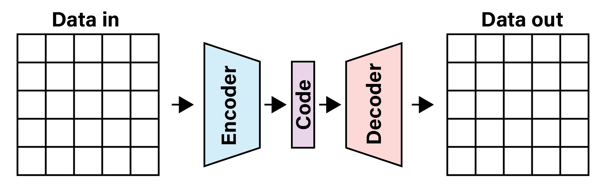
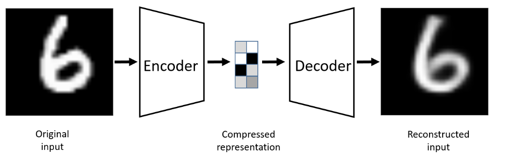
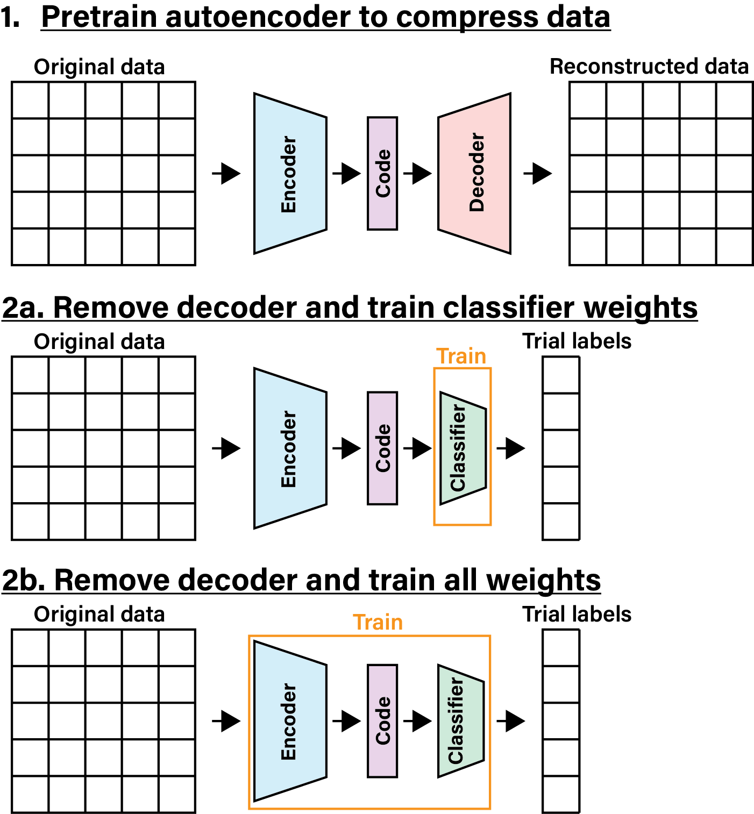

# Feature learning

So far we have performed decoding by first processing our brain data to extract or highlight features in it that we think are associated with the events we wish to decode. In the case of the EEG data, we got the mean evoked response potential to a stimulus, and then for each trial took the dot product of the mean response with the trial data to get a single number that we could use to classify the trial. For the ECoG data so far, we calculate the power spectrum on each electrode around a finger movement. The movement of a given finger is associated with an increase in power at middle frequencies on just a select few electrodes. Both of these methods are examples of *feature engineering* that are informed by our knowledge of brain organization, neural responses to events, and the physics of the recording modality.

But perhaps our knowledge is holding us back. Perhaps we can do better by letting the data speak for itself. By letting the training algorithm optimize not just the classifier but the features that are extracted from the raw neural data. This is the idea behind *feature learning*. In this notebook we will explore feature learning in the context of supervised and unsupervised learning.

## The Bitter Lesson

In 2019 Richard S. Sutton, a professor of computer science at the University of Alberta (and recent winner of the [Turing Award](https://awards.acm.org/about/2024-turing) for his work on reinforcement learning), wrote a paper called ["The Bitter Lesson"](http://www.incompleteideas.net/IncIdeas/BitterLesson.html) in which he argued that the history of AI research has shown that the most successful methods are those that can scale with the amount of data and computation available. He argues that the most successful methods are those that can learn from the data, rather than those that rely on human knowledge to guide the learning.

He based this on the history of natural language processing, the search for algorithms that can process human language. Early methods relied on hand-crafted rules that were based on the knowledge of linguists. But these methods were quickly surpassed by statistical methods that learned the rules from the data. The same is true for computer vision, where early methods relied on hand-crafted features, but were surpassed by deep learning methods that learned the features from the data.

Thus, we may be able to improve the performance of our decoders by incorporating feature learning into our decoding pipeline. Instead of just training a logistic decoder on the features we extract from the data, we can graft a neural network on the front of the decoder, placing it between the raw data and the logistic decoder. By allowing the training process to modify the weights of the logistic decoder *and* the neural network, we can learn features that are optimized for the decoding task.

## Data loading

We will start by loading the raw ECoG data and the finger movement labels. First we will import the standard packages we we work with, along with some helper classes for loading the ECoG data. Note also that we set the random seeds for reproducibility.

```{python}
import os.path as op
import copy
import numpy as np
import matplotlib.pyplot as plt
from sklearn.metrics import balanced_accuracy_score, confusion_matrix, ConfusionMatrixDisplay
from sklearn.model_selection import StratifiedKFold
from sklearn.decomposition import PCA
from IPython.display import HTML
import torch
import torch.nn as nn
import torch.nn.functional as F
from torch.utils.data import Dataset, DataLoader

import sys
sys.path.append('..')
from source.utils import zscore
from source.loaders import EcogFingerData
from source.decoders import format_ecogfinger_data_raw, ECoGData, LogRegPT_MC, LogRegPT_AE

# Set random seeds for reproducibility
np.random.seed(4)
torch.manual_seed(2) #2
```

Let's now load the data from the subject we have been working with for the last few weeks.

```{python}
# select dataset
subj = 'cc'
ecog_path = ['data/ecog/', subj, '{}_fingerflex.mat'.format(subj)]
ecog_file = op.join(*ecog_path)

# load data
ecog_data = EcogFingerData(ecog_file)

# list of finger names
finger_names = ['thumb', 'index', 'middle', 'ring', 'little']
```

Here is where things change, instead of loading the power spectra for each electrode surrounding finger movements, we will get the raw ECoG voltage signal.

```{python}
# get flex times
feats = {}
lbls = {}
for ind, finger in enumerate(finger_names):
    flex_times = ecog_data.detect_flex_onsets(finger)
    feats[finger], lbls[finger] = format_ecogfinger_data_raw(ecog_data, flex_times)

# pool together all data
feats_all = np.concatenate([feats[finger] for finger in finger_names], axis=0)
lbls_all = np.concatenate([lbls[finger]*(i+1) for i,finger in enumerate(finger_names)], axis=0)

# keep a random subset of no finger trials equal in number to the number of individual finger trials

# get the median number of labels for each finger
n_lbls = np.median(np.bincount(lbls_all.squeeze().astype(int))).astype(int)

# get the indices of the no finger trials
no_finger_inds = np.where(lbls_all==0)[0]

# randomly select a subset of no finger trials to keep, equal in number to the median number of labels for each finger
no_finger_inds = np.random.choice(no_finger_inds, size=n_lbls, replace=False)

# keep the selected no finger trials and all of the individual finger trials
inds = np.concatenate([no_finger_inds, np.where(lbls_all)[0]])
feats_sub = feats_all[inds,:]
lbls_sub = lbls_all[inds]
```

We have taken only a subset of the data so we have an equal number of trials for each finger flexion and no flexion. `lbls_sub` is a list of labels for each trial, where 0 is no flexion and 1-5 are the fingers. `feats_sub` is a 3-dimensional numpy array, where the first dimension is the trial number, the second dimension is the electrode number (63), and the third dimension is the time point. The time points are sampled at 1000 Hz. Since we only take the time 200ms before and after the flexion, there are 400 times points.

```{python}
print('Size of our data: {}'.format(feats_sub.shape))
```

## Supervised feature learning

In *supervised feature learning*, we use the feedback from our decoder to adjust the parameters of the lower layers of our decoder that are performing the feature extraction. In this way, we can learn features that are optimized for the decoding task. This is not so different from how we have trained our logistic decoders so far, except now we are adding additional layers to the decoder and letting the training process adjust the weights of those layers as well.

These layers are commonly used in deep neural networks, and we will use some of them here. But before we dive into the details of these new architectures, there is one change we will make to the way we train our decoders. We will change the optimizer we use to update the weights of the network. Instead of using stochastic gradient descent (SGD), we will use the Adam optimizer.

### Adam optimizer

The Adam optimizer is an extension to stochastic gradient descent that has been shown to work well in training deep neural networks. It keeps track of the average and the variance of the gradients for each weight in the network, and uses these to adjust the learning rate for each weight. This allows the optimizer to adapt the learning rate for each weight individually, which can lead to faster convergence and better performance.

To add the Adam optimizer to our decoder, we just have to swap out the SGD optimizer for the Adam optimizer. In PyTorch, this is as simple as changing one line of code. Instead of using `optim.SGD`, we will use `optim.Adam`.

``` python
def _create_optim(self):
    # initialize optimizer
    return torch.optim.Adam(self._model.parameters(), lr=self.lr)
```

### Linear layers

A linear layer is a simple transformation that applies a linear function to the input data. In fact, the linear transform we have been applying to the data before passing it through the logistic function, $y = Wx + b$, is a linear layer. The weights `W` and biases `b` are the parameters of the linear layer. In PyTorch, we can implement a linear layer using the `nn.Linear` class.

Often when we create a linear layer in a neural network, it is not just the linear transformation that we apply to the data. We often follow the linear transformation with a non-linear activation function, such as the sigmoid.

Why should we bother with a non-linear activation function? Well, if you take two linear transformations and stack them together, you still just have a linear transformation. $y = W_2(W_1x + b_1) + b_2 = (W_2W_1)x + (W_2b_1 + b_2)$. So if we only use linear layers, we can always just replace the entire stack of layers with a single linear layer. By adding non-linear activation functions, we can learn more complex functions that can better model the data. One decoding problem that requires such a complex function is known as 'the XOR problem'. This is a classic example in machine learning that shows why linear transforms by themselves are not always sufficient.

Here we will create simple dataset to demonstrate this. It will have two classes, and each class will be built from two Gaussian distributions.

```{python}
# generate a demo scatterplot of data that shows the xor problem
# generate some data
np.random.seed(0)
x1 = np.random.normal([0,0], 1, (100, 2))
x2 = np.random.normal([10,10], 1, (100, 2))
x3 = np.random.normal([0,10], 1, (100, 2))
x4 = np.random.normal([10,0], 1, (100, 2))

# combine the data
X = np.vstack((x1, x2, x3, x4))

# create labels
y_nosep = np.repeat([0, 1], 200)
y_sep = np.repeat([0, 1, 1, 0], 100)

# plot the data
fig, ax = plt.subplots(1, 2, figsize=(10, 5))
ax[0].scatter(X[:,0], X[:,1], c=y_sep, cmap='coolwarm')
ax[0].set_title('Data that is linearly separable')
ax[0].axhline(y=5, color='gray', linestyle='--')
ax[0].text(0, 5.2, 'Decision boundary', fontsize=12, color='gray')
ax[1].scatter(X[:,0], X[:,1], c=y_nosep, cmap='coolwarm')
ax[1].set_title('Data that is not linearly separable')
ax[1].text(1, 5.2, 'Decision boundaries?', fontsize=12, color='gray')
ax[1].plot([-3, 7.5], [2, 13], '--', color='gray')
ax[1].plot([4, 15.5], [-4, 11], '--', color='gray')
ax[1].set_xlim(ax[0].get_xlim())
ax[1].set_ylim(ax[0].get_ylim())

```

Can you imagine drawing a single line that will evenly divide the blue and red clusters? For the linearly separable case, we can use a draw a single line that splits them. But for the case that is not linearly separable, we would need to combine multiple decision boundaries group together clusters with the same color. To do this, we can envision creating a multiclass logistic function that creates the two lines shown here (one class is on the upper-side of the top line, and the other class is on the lower-side of the bottom line). Then, we would take the output of that multiclass logistic function and pass it to a regular logistic function that determines if either class is present. This is a simple example of how we can use multiple linear layers with non-linear activation functions to learn more complex decision boundaries.

Crucially, this can only be solved with the added non-linearity of the activation function.

In Pytorch the linear transform is implemented with the `nn.Linear` class. It requires two arguments, the number of input features and the number of output features. It also has a bias term by default, which we will keep.

#### ReLU activation

For our logistic decoder, we have been using the sigmoid activation function. But for the layers in our network that are trained to extract features, we will use a different activation function, called the rectified linear unit (ReLU). The ReLU activation function is defined as $f(x) = max(0, x)$. This means that if the input is positive, it returns the input. If the input is negative, it returns 0. This has been shown to work well in practice for many deep learning tasks.

Why change the activation function anyway? First, the sigmoid activation function can suffer from the vanishing gradient problem. This means that if the input to the sigmoid function is very large or very small, the gradient of the function becomes very small. This can make it difficult for the network to learn. The ReLU activation function does not suffer from this problem (at least for positive values) because it has a constant gradient of 1 for positive inputs. Second, the ReLU activation function has been shown to work well in practice for many deep learning tasks. Lastly, it is computationally efficient and has been found to lead to faster convergence during training.

The ReLU activation function is implemented in PyTorch with the `nn.ReLU` class. It does not require any arguments.

#### Batch normalization

When we train a neural network with multiple layers, the distribution of the inputs to each layer can change as the parameters of the previous layers are updated, or between batches of data. This sometimes makes it difficult for the network to learn. Batch normalization is a technique that helps to stabilize the distribution of the inputs to each layer by normalizing the inputs to have a mean of 0 and a standard deviation of 1. This helps improve the convergence of the network during training, and generalize to the held out test data. During training, the mean and standard deviation are calculated from the current batch of data. During testing, the mean and standard deviation are calculated from the entire training dataset.

Normalization is typically applied to the output of the linear layer and before the activation function. In PyTorch, batch normalization is implemented with the `nn.BatchNorm1d` class. It requires one argument, the number of features in the input data.

A demo of batch normalization built with Numpy is shown below:

```{python}
def norm1d(x):
    x_mean = np.mean(x, axis=(0,2), keepdims=True)
    x_std = np.std(x, axis=(0,2), keepdims=True)
    x_norm = (x - x_mean) / x_std
    return x_norm

feats_sub_z = norm1d(feats_sub)
```

In Pytorch, the data tensors we use to store the features are usually specified as 2+n dimensional. The first dimension is the 'batch size', the second dimension is the number of 'channels', and the remaining dimensions are used to store the spatial or temporal structure of the data. Our ECoG data is stored as a 3D tensor, where the first dimension is the trial number, the second dimension is the electrode number, and the third dimension is the time point. Given this, our example function takes the mean and standard deviation across the batch and time dimensions, but not across the electrode dimension. This is because we want to normalize the data for each electrode (i.e. channel) separately. We will save the z-normalized version of our data for later use during unsupervised learning.

#### Building the linear layer

Now that we have all the parts, we can start building the linear layer. We are going to stack three of these layers together, which should give the network more power to learn a complex decision boundary. We will reuse our multiclass logistic decoder class that was implemented in Pytorch. All we have to change is the `_create_model` method to include the new layers.

```{python}
class LogRegPT_MC_Linear(LogRegPT_MC):

    def _create_model(self):
         # layer where regularization is applied
        self.reg_layer = -1

        # input size is the number of features, input will be flattened
        input_size = np.prod(self._X_shape[1:])

        # define a linear layer with batch normalization and ReLU activation
        def linear_layer(input_size, output_size):
            lin = nn.Sequential(
                nn.Linear(input_size, output_size),
                nn.BatchNorm1d(output_size),
                nn.ReLU()
            )
            return lin
        
        # logistic regression model is a sequential combination of linear and sigmoid layers
        model = nn.Sequential(
            nn.Flatten(1), # flatten the input so that each trial is a row and each column is a feature
            linear_layer(input_size, 100),
            linear_layer(100, 50),
            linear_layer(50, 20),
            nn.Linear(20, self._n_classes),
        )
        self._model = model
```

There is a lot going on here, so lets unpack it.

``` python
# layer where regularization is applied
self.reg_layer = -1

# input size is the number of features, input will be flattened
input_size = np.prod(self._X_shape[1:])
```

Since our model will now feature multiple layers, we cannot assume that the regularization we perform on the logistic decoder will always be applied to the same layer. But, since the logistic decoder will always be the last layer, we can just set the `self.reg_layer` to -1, which will always refer to the last layer.

Next we need to specify the input size to the first layer. Since we are using a linear layer, we need to specify the number of input features. In our case, the input features are the flattened ECoG data. So we need to calculate the total number of features by taking the product of the dimensions of the ECoG data, excluding the first dimension (which is the trial number). This is done with `np.prod(self._X_shape[1:])`. In this case, we have 63 electrodes and 400 time points, so the input size is 25,200.

The next bit of code creates a function that will make it easier to create the layers.

``` python
def linear_layer(input_size, output_size):
    lin = nn.Sequential(
        nn.Linear(input_size, output_size),
        nn.BatchNorm1d(output_size),
        nn.ReLU()
    )
    return lin
```

This function creates a sequential model that includes a linear layer, batch normalization, and the ReLU activation function. It takes the input size and output size as arguments and returns the sequential model.

With this function, we can now use the `nn.Sequential` class to stack the layers together.

The first layer will take the flattened ECoG data as input and output 100 features. The second layer will take those 100 features as input and output 50 features. The final layer will take those 50 features as input and output the number of classes (6 in our case, for the 5 fingers and no flexion).

``` python
model = nn.Sequential(
    nn.Flatten(1),
    linear_layer(input_size, 100),
    linear_layer(100, 50),
    linear_layer(50, 20),
    nn.Linear(20, self._n_classes),
)

self._model = model
```

The `nn.Flatten(1)` layer is used to flatten the input data, starting from the second dimension (the first dimension is the batch size). This is necessary because the linear layers expect a 2D input, where the first dimension is the batch size and the second dimension is the number of features.

The raw ECoG data is passed through three linear layers prior to reaching the logistic decoder at the end. The first layer takes the 25,200 features of the flattened ECoG data and outputs 400 features. The second layer takes those 400 features and outputs 100 features. The third layer takes those 100 features and outputs 50 features. This narrowing down of the features encourages the network to learn a more compact representation of the data that is useful for the decoding task. At the last layer we just use a regular `nn.Linear` layer, whose output will be passed to a softmax function yielding class probabilities (5 fingers and no flexion).

Note how much simpler our model description is when we define a function to create the layers. This makes it much easier to add or remove layers in the future, and to experiment with different architectures. If we had not used such a function, our model would instead have been verbose:

``` python
model = nn.Sequential(
    nn.Flatten(1),
    nn.Linear(input_size, 100),
    nn.BatchNorm1d(100),
    nn.ReLU(),
    nn.Linear(100, 50),
    nn.BatchNorm1d(50),
    nn.ReLU(),
    nn.Linear(50, 20),
    nn.BatchNorm1d(20),
    nn.ReLU(),
    nn.Linear(20, self._n_classes)
)
```

That description is less clear than the one in our code. Moreover, as you will see below, if we want to change how our linear layer is implemented, it would require us to change every instance of the layer in the model description. By using a function, we can just change the function and all the layers will be updated automatically.

Finally, we assign the model to `self._model`, which is the attribute that is used by the rest of the class to access the model.

```{python}
# trying multiclass logistic regression
lr_lin = LogRegPT_MC_Linear(shuffle_seed=2, epochs=250, batch_size=30, lr=0.001)
test_perf, train_perf = lr_lin.fit(feats_sub, lbls_sub)

# print train and test performance with 1 decimal place
print('Train performance: {:.1f}'.format(train_perf))
print('Test performance: {:.1f}'.format(test_perf))
```

The performance of the model on the training data is near perfect at 98.6% accuracy. However, for the testing data it is only 50.1%. This is better than the chance level of 16.7% (1/6). Perhaps we are not running the training for long enough. Since we have dramatically increased the complexity of the model, it may be the case that we need to give it more training epochs to optimize its parameters. To see if this is the case, let's examine how performance on the training and test data sets changed during training.

```{python}
def plot_training_performance(mdl, ax = None):
    if ax is None:
        fig, ax = plt.subplots()

    train_scores = mdl._score_train
    test_scores = mdl._score_test
    epochs = np.arange(len(train_scores))*10
    ax.plot(epochs, train_scores, label='train')
    ax.plot(epochs, test_scores, label='test')
    ax.set_xlabel('Epoch')
    ax.set_ylabel('Balanced accuracy')
    ax.set_ylim([0, 105])
    ax.legend()
    ax.set_title('Performance over training epochs')
    return ax

plot_training_performance(lr_lin)
```

Within the first 10 epochs performance on the training and test dataset was near their peaks. This suggests that the problem is not the need for additional training. One possibility for the training dramatically exceeding the test is overfitting, where the model learns the training data so well that it memorizes individual samples and does not generalize to new data.

In previous lectures, we avoided overfitting with regularization. Here we can apply a regularization technique frequently used in neural networks called *dropout*. But first, let's see what features our network learned about the data.

#### Identifying the learned features

Once the network has been trained we can inspect the learned features. This is easiest to do with the first layer, since it is directly connected to the raw ECoG data. The weights will be a matrix of size 100x25,200, where each row corresponds to one of 100 features and each column corresponds to one of the 25,200 combinations of channel and time point. We can visualize these weights as a grid of images, where each image corresponds to one of the input features.

```{python}
# Extract weights from the model
weights = lr_lin._model[1][0].weight.detach().numpy()
weights = weights.reshape(-1, 63, 400)

# Plot a few selected weights
fig, axs = plt.subplots(1, 4, figsize=(15, 5))
axs[0].imshow(weights[3,:,:], aspect='auto', extent=[-200, 200, 0, 63], cmap='coolwarm')
axs[1].imshow(weights[30,:,:], aspect='auto', extent=[-200, 200, 0, 63], cmap='coolwarm')
axs[2].imshow(weights[42,:,:], aspect='auto', extent=[-200, 200, 0, 63], cmap='coolwarm')
axs[3].imshow(weights[77,:,:], aspect='auto', extent=[-200, 200, 0, 63], cmap='coolwarm')
fig.suptitle('Selected weights from the model')
fig.supxlabel('Time (ms)')
fig.supylabel('Channel')
fig.tight_layout()
```

The patterns learned don't seem to resemble anything we have seen before in response to finger flexion. This could be because the subsequent linear layers combine these features in a way that solves the decoding problem, so looking at them in isolation is not as informative. Despite this, repeated patterns can be seen across channels that is reminiscent of the types of spatial patterns we have seen before with the ECoG grid.

Perhaps there is a pattern in the strength of the weights? We know that certain channels were more sensitive to finger flexion than others, and that the signal changes on them tended to happen at the time of flexion. Thus, the weights for those channel/time point combinations should be higher than the weights for other channel/time point combinations. We can visualize this by taking the mean of the absolute value of the weights across all time points for each channel, and then plotting those means.

```{python}
weights_str = np.mean(np.abs(weights), axis=0)
fig, ax = plt.subplots()
im = ax.imshow(weights_str, aspect='auto', extent=[-200, 200, 0, 63], cmap='coolwarm')
cbar = ax.figure.colorbar(im, ax=ax)
ax.set_title('Magnitude of weights')
ax.set_xlabel('Time (ms)')
ax.set_ylabel('Channels')
```

Here we can see that there are a few channels that have high weights. Moreover, these larger weights tend to be around time 0 ms, when the finger flexion occurred.

#### Dropout

Dropout is a regularization technique that randomly sets a fraction of the input units to 0 at each update during the training time. This helps to prevent overfitting by making the network not depend too much on any one input or combination of inputs. Instead, the network must learn to generalize from the data. Dropout is typically applied to the output of a layer. In PyTorch, dropout is implemented with the `nn.Dropout` class. It requires one argument, the dropout probability, which is the fraction of input units to drop. A common value for this is 0.5, meaning that half of the input units will be randomly set to 0 during training.

```{python}
class LogRegPT_MC_Dropout(LogRegPT_MC):

    def _create_model(self):
         # layer where regularization is applied
        self.reg_layer = -1

        # input size is the number of features, input will be flattened
        input_size = np.prod(self._X_shape[1:])
        
        def linear_layer(input_size, output_size):
            lin = nn.Sequential(
                nn.Linear(input_size, output_size),
                nn.BatchNorm1d(output_size),
                nn.ReLU(),
                nn.Dropout(0.5) #<-- add dropout layer with 50% probability
            )
            return lin
        
        # logistic regression model is a sequential combination of linear and sigmoid layers
        model = nn.Sequential(
            nn.Flatten(1), # flatten the input so that each trial is a row and each column is a feature
            linear_layer(input_size, 100),
            linear_layer(100, 50),
            linear_layer(50, 20),
            nn.Linear(20, self._n_classes),
        )
        self._model = model
```

Since we defined our linear layers with a function, it was easy to add a dropout to all of them. We just need to add the `nn.Dropout` layer after the ReLU activation function in the `linear_layer` function.

Let's now train the model with dropout and see how it performs.

```{python}
# trying multiclass logistic regression
lr_do = LogRegPT_MC_Dropout(shuffle_seed=2, epochs=250, batch_size=30, lr=0.001)
test_perf, train_perf = lr_do.fit(feats_sub, lbls_sub)

print('Train performance: {:.1f}'.format(train_perf))
print('Test performance: {:.1f}'.format(test_perf))
plot_training_performance(lr_do)
```

Adding dropout slowed the training, with accuracy on the training data taking longer to reach its peak. Performance on the testing data was better, though, with accuracy now at 61.6%. However, this performance is still not as good as we were getting with our logistic decoder using spectral power, whose performance was in the 80s. While it is tempting to try adding more linear layers to see if performance can be improved, it might be better to try a different kind of architecture that is more suited to the time-series nature of the ECoG data. One such architecture is a *convolutional neural network*, which we will explore next.

Here too we can inspect the weights in the first layer to see if we can identify any interesting features that the network has learned. Perhaps adding dropout has changed the kinds of features that are learned.

```{python}
# Extract weights from the model
weights = lr_do._model[1][0].weight.detach().numpy()
weights = weights.reshape(-1, 63, 400)

# Plot a few selected weights
fig, axs = plt.subplots(1, 4, figsize=(15, 5))
axs[0].imshow(weights[3,:,:], aspect='auto', extent=[-200, 200, 0, 63], cmap='coolwarm')
axs[1].imshow(weights[30,:,:], aspect='auto', extent=[-200, 200, 0, 63], cmap='coolwarm')
axs[2].imshow(weights[42,:,:], aspect='auto', extent=[-200, 200, 0, 63], cmap='coolwarm')
axs[3].imshow(weights[77,:,:], aspect='auto', extent=[-200, 200, 0, 63], cmap='coolwarm')
fig.suptitle('Selected weights from the model')
fig.supxlabel('Time (ms)')
fig.supylabel('Channel')
fig.tight_layout()
```

```{python}
weights_str = np.mean(np.abs(weights), axis=0)
fig, ax = plt.subplots()
im = ax.imshow(weights_str, aspect='auto', extent=[-200, 200, 0, 63], cmap='coolwarm')
cbar = ax.figure.colorbar(im, ax=ax)
ax.set_title('Magnitude of weights')
ax.set_xlabel('Time (ms)')
ax.set_ylabel('Channels')
```

Adding dropout seems to have resulted in a sparser distribution of weights.

### Convolutional layers

The ECoG data is made up of voltage measurements taken across multiple electrodes at fixed time intervals. This means that the data has a spatial structure (the electrodes) and a temporal structure (the time points). Adjacent time points on the same electrode will tend to have similar values. What we are looking for are patterns in their sequence of values that indicate whether a flexion occurred. A convolutional neural network (CNN) is a type of neural work that is particularly well-suited for data with this kind of structure. CNNs use a special kind of layer called a convolutional layer, which applies a convolution operation to the input data. This allows the network to learn spatial and temporal features from the data.

In our case, we will ignore the absolute spatial positions of the electrodes and just treat each one as a separate 'channel' of data.

#### Convolutional layer

A convolutional layer applies a convolution operation to the input data. This involves sliding a small filter (or kernel) over the input data and computing the dot product between the filter and the input data at each position. This allows the network to learn local patterns in the data. For 1 dimensional convolution, filter has a dimensionality of `[n_channels, n_timepoints]`, where `n_timepoints` is specified by us. This means that a single filter detects patterns in the series of voltages that are expressed across multiple channels.

Some common parameters for a convolutional layer include:

\- `in_channels`: the number of input channels (in our case, the number of electrodes)

\- `out_channels`: the number of output channels (the number of filters)

\- `kernel_size`: the size of the filter (the number of time points in the filter)

\- `stride`: the amount by which the filter is moved at each step (default is 1)

\- `padding`: the amount of zero-padding added to the input data (default is 0)

\- `dilation`: the spacing between the kernel points across time (default is 1)

\- `bias`: whether to include a bias term (default is True)

To visualize how each of these impact the convolution operation, check out these [animations](https://github.com/vdumoulin/conv_arithmetic). We can explore how the convolution operation works with the functional version of it in Pytorch. For this we will use the `F.conv1d` function, which applies a 1-dimensional convolution to the input data.

```{python}
#
weights = torch.tensor([[[0,0,0],[0,1,-1],[0,1,-1]]]).float()

in_data = torch.tensor([[0,1,0,0,0,0,0,0,0,0,0,0,0], 
                        [0,0,0,0,1,0,0,0,0,0,1,0,0],
                        [0,0,0,0,0,0,0,1,0,0,1,0,0]]).reshape(1,3,-1).float()

out_data = F.conv1d(in_data, weights)

print('Filter weights: \n\r{}'.format(weights.squeeze()))
print('In shape: {}'.format(in_data.shape))
print('Out shape: {}'.format(out_data.shape))
```

The filter we are creating here samples 3 time points across 3 channels. It is going to be insensitive to anything happening on the first (top) channel, since all the weights there are set to zero. The other two channels have weights with the sequence `[0, 1, -1]`, which act as detectors of a single sample increase in voltage followed by a single sample decrease in voltage.

After we apply the convolution operation, we can see that the output is a new tensor that has a different size. The first dimension has the same size since convolutional is applied to each item in the batch separately and we only have 1 item in our batch. The second dimension has gone from 3 to 1. This happened because the number of channels in our input data was 3, but we only had 1 filter specified, so only one channel is returned. Lastly, the time dimension is smaller. This is because the convolution operation reduced the size of the input data. The size of the output data depends on the size of the input data, the size of the filter, the stride, and the padding. In this case, we used a stride of 1 and no padding, so the output size is smaller than the input size. To keep the size consistent, we can add extra padding to the input data using the `padding` argument. This will add zeros to the beginning and end of the input data, which will keep the output size the same as the input size.

```{python}
out_data = F.conv1d(in_data, weights, padding=1)

fig, ax = plt.subplots(2,1, figsize=(5,5), sharex=True)
ax[0].imshow(in_data.squeeze(), aspect='equal', cmap='coolwarm', vmin=-2, vmax=2)
ax[0].set_title('Input')
ax[1].imshow(out_data[0], aspect='equal', cmap='coolwarm', vmin=-2, vmax=2)
ax[1].set_title('Output')
fig.tight_layout()
```

Looking over the output, we can how the convolution transforms the input to create the output. The first (top) channel is ignored since its weights were all zero. When an event occurred on either channel 2 or 3, the filter was reflected in the output. If both channels 2 and 3 had the same event, the output was a bit larger. This is because the filter was able to summed the events on both channels.

With only 3 time points in our filter, the duration of features we can detect in the time series is limited. Indeed, the neural events we care about tend to happen over dozens of samples. To detect longer duration features, We could create a larger kernel with more time points. However, this would also increase the number of parameters in the model, which could lead to overfitting if we are not careful. Since adjacent time points tend to be correlated, adjacent weights would be redundant. Instead, we could increase the dilation, spacing out the weights in the filter. This would allow us to detect features that are spread out over a longer period of time, while keeping the number of parameters the same.

```{python}
# use pytorch to interpolate over in_data increasing its length by a factor of 10
in_data_long = F.interpolate(in_data, scale_factor=10, mode='nearest')
out_data_d1 = F.conv1d(in_data_long, weights, padding=1)
out_data_d10 = F.conv1d(in_data_long, weights, padding=1, dilation=10)

fig, ax = plt.subplots(3,1, figsize=(5,5), sharex=True)
ax[0].imshow(in_data_long.squeeze(), aspect='auto', cmap='coolwarm', vmin=-2, vmax=2)
ax[0].set_title('Input')
ax[1].imshow(out_data_d1[0], aspect='auto', cmap='coolwarm', vmin=-2, vmax=2)
ax[1].set_title('Output with dilation=1')
ax[2].imshow(out_data_d10[0], aspect='auto', cmap='coolwarm', vmin=-2, vmax=2)
ax[2].set_title('Output with dilation=10')
fig.tight_layout()
```

By setting the dilation equal to the size of the features we want to detect, we can create a filter that samples the time series at intervals consistent with the patterns we wish to extract. However, we can now see that much of the information in the time series being outputted is redundant. The value at a given time point will often be the same as the value at the nearest 10 other time points. This redundancy can be reduced using *max pooling*, which we will explore next.

#### Max pooling

Max pooling is a downsampling technique that reduces the size of the input data by taking the maximum value over a specified window. This helps to reduce the redundancy in the data and makes the network more robust to small changes in the input data. Max pooling is typically applied after a convolutional layer. In PyTorch, max pooling is implemented with the `nn.MaxPool1d` class. It requires one argument, the size of the pooling window.

We can explore the max pooling operation with the functional version of it in Pytorch. For this we will use the `F.max_pool1d` function, which applies a 1-dimensional max pooling to the input data. A max pooling operation accepts many of the same parameters used in convolution. Here we will use the size of the window to take the maximum over (which is analogous to the kernel size), and the stride, which is how much to move the window at each step. In our case, the features we care about have a size of 10, so we will use a window size of 10 and a stride of 10. This means that we will take the maximum value over every 10 time points, and then move the window by 10 time points for the next operation. This will reduce the size of the output data by a factor of 10.

```{python}
out_data_pool = F.max_pool1d(out_data_d10, kernel_size=10)

fig, ax = plt.subplots(2,1, figsize=(5,5))
ax[0].imshow(out_data_d10[0], aspect='auto', cmap='coolwarm', vmin=-2, vmax=2)
ax[0].set_title('Output with dilation=10, no pooling')
ax[1].imshow(out_data_pool[0], aspect='auto', cmap='coolwarm', vmin=-2, vmax=2)
ax[1].set_title('Output with max pooling')
fig.tight_layout()
```

In general, the convolution and pooling operations are building in two assumptions into our model. First, that the features we care about are patterns that are spread over time and can occur at any time point. Second, that the exact timing of the feature is not as important as the presence of the feature. Both assumptions can dramatically decrease the number of parameters needed to specify our model. Instead of giving every combination of electrode and time point its own weight, which we did in the first linear layer of the previous decoder, we have those parameters shared across all time points. This is known as parameter sharing, and it is a key reason why convolutional neural networks are so powerful. Another reduction in parameters comes from the max pooling operation, which downsamples the data and reduces the number of time points we need to consider in the subsequent layers.

#### Implementing a convolutional layer

Now that we understand how convolutional and pooling layers work, we can implement a convolutional layer in our multiclass logistic decoder. We will replace the first linear layer with a convolutional layer. The output of the convolutional layer will be passed to a max pooling layer, which will downsample the data. After that, we will add two more linear layers, which will take the output of the max pooling layer as input.

```{python}
class LogRegPT_CNN(LogRegPT_MC):
    
    def _create_model(self):

         # layer where regularization is applied
        self.reg_layer = -1

        n_ecog_ch = self._X_shape[1]
        n_conv_ch = 40
        ks = 21
        mp = 20
        lin_input_sz = n_conv_ch * (self._X_shape[2]//mp) 


        # CNN layer
        def cnn_layer(input_size, output_size):
            cnn = torch.nn.Sequential(
                torch.nn.Conv1d(input_size, output_size, kernel_size=ks, stride=1, dilation=3, padding='same'), 
                torch.nn.BatchNorm1d(output_size), 
                torch.nn.ReLU(), 
                torch.nn.MaxPool1d(kernel_size=mp, stride=mp),
                torch.nn.Dropout1d(0.5), 
            )
            return cnn
        
        def linear_layer(input_size, output_size):
            lin = torch.nn.Sequential(
                torch.nn.Linear(input_size, output_size),
                torch.nn.BatchNorm1d(output_size),
                torch.nn.ReLU(),
                torch.nn.Dropout(0.5)
            )
            return lin
        
        model = torch.nn.Sequential(
            cnn_layer(n_ecog_ch, n_conv_ch),
            torch.nn.Flatten(1),
            linear_layer(lin_input_sz, 50),
            linear_layer(50, 20),
            torch.nn.Linear(20, self._n_classes),
        )

        self._model = model
```

We keep the two linear layers from the previous models, and add a convolutional layer at the beginning. The convolutional layer is defined as:

``` python
def cnn_layer(input_size, output_size):
    cnn = torch.nn.Sequential(
        torch.nn.Conv1d(input_size, output_size, kernel_size=ks, stride=1, dilation=3, padding='same'), 
        torch.nn.BatchNorm1d(output_size),
        torch.nn.ReLU(), 
        torch.nn.MaxPool1d(kernel_size=mp, stride=mp),
        torch.nn.Dropout1d(0.5),
    )
    return cnn
```

The `cnn_layer` function creates a sequential model that includes a convolutional layer, batch normalization, ReLU activation function, max pooling, and dropout. Since our sample rate is 1000 Hz, and the features we care about last for 10s of samples (spectral power in the 100 Hz frequency range was indicative of a finger flexion), we will use a kernel size of 21. Setting the dilation to 3 means that the weights in the filter can detect features that are spread out over 60 ms. Following convolution, we apply `nn.BatchNorm1d` to normalize the input features of each channel. This is followed by the ReLU activation function to introduce non-linearity. After that, we apply max pooling with a kernel size of 20 and a stride of 20 to downsample the data. Finally, we apply dropout with `nn.Dropout1d`, which randomly sets entire channels to 0 for each sample in the batch. The reason for using this and not the standard dropout is because adjacent samples are correlated in time series data, so just dropping out random time points still leaves information that can be used between channels to solve the decoding problem. Often such between-channel dependencies encourage memorization of training samples. Dropout mitigates this.

To build the final model, we declare:

``` python
model = torch.nn.Sequential(
    cnn_layer(n_ecog_ch, n_conv_ch),
    torch.nn.Flatten(1),
    linear_layer(lin_input_sz, 100),
    linear_layer(100, 50),
    torch.nn.Linear(50, self._n_classes),
)
```

The `cnn_layer` function is used to create the convolutional layer, which takes the number of ECoG channels as input and outputs the number of convolutional channels. The output of the convolutional layer is then flattened and passed to two linear layers, which can detect arbitrary patterns across channels and time points. The final layer is a linear layer that outputs the number of classes.

```{python}
lr_cnn = LogRegPT_CNN(shuffle_seed=2, epochs=250, batch_size=30, lr=0.001)
score_test, score_train = lr_cnn.fit(feats_sub, lbls_sub)

print('Train performance: {:.1f}'.format(score_train))
print('Test performance: {:.1f}'.format(score_test))
plot_training_performance(lr_cnn)
```

Using a convolutional layer as the first step in our model seemed to improve performance, bringing us up to 68.7% on the test set. This is likely because the convolutional filters in the first layer capture spatial (i.e. electrode) and temporal patterns in the ECoG data that were not consistent in their timing relative to flexion onset, but were consistently expressed depending on the finger that was flexed. We can examine the kinds of features the convolutional layer is learning by plotting the weights of the filters.

```{python}
# get weights from convlution layer
weights = lr_cnn._model[0][0].weight

# plot convolution filters
fig, axs = plt.subplots(2, 10, figsize=(5, 3))
for i, ax in enumerate(axs.flatten()):
    ax.imshow(weights[i].detach().numpy(), cmap='coolwarm')
    ax.set_title('{}'.format(i+1))
    ax.axis('off')
fig.tight_layout()
```

Each of the filters is a 2D array, where the rows are channels and the columns are time points. We can visualize these filters as images, where each image corresponds to one of the filters. Most of the filters show one or two channels with strong positive weights, and the rest of the channels with weak negative weights.

## Unsupervised feature learning

In unsupervised feature learning, we do not use the labels for the data. Instead, we want to identify features from the data itself. This can be useful for a number of reasons. First, it can help us to understand the structure of the data and find patterns that we might not have seen otherwise. Second, the features we learn can reduce the dimensionality of the data, which can make it easier to work with. Finally, unsupervised feature learning can be used as a pretraining step for supervised learning, where we can use the learned features to initialize the weights of a neural network before training it on labeled data.

### Autoencoders

A common type of unsupervised feature learning is *data compression*, where we learn a smaller representation of the data that captures the most important information needed to reconstruct it. One way to do this is with an *autoencoder*, which is a type of neural network that is trained to take the data as input and return the same data as output. An autoencoder has two parts: an *encoder*, which compresses the data into a smaller representation, sometimes called a *code* or *embedding*. This is then passed to a *decoder*, which reconstructs the data from the smaller representation. By training the autoencoder to minimize the difference between the input and output data, it forms a compressed representation of the data that captures its most salient features.



Autoencoders have been used for many years in the machine learning field. [For example](https://arxiv.org/abs/2003.05991), one can use an autoencoder to learn a compressed representation of the MNIST dataset, which consists of images of handwritten digits. The autoencoder learns a representation of the digit images that is smaller than the original images, and that can be used to reconstruct the images with high accuracy.



### Using an autoencoder for feature learning

You can use the features learned by an autoencoder for a variety of tasks. For example, you can use the compressed representation as input to a supervised learning task, such as classification or regression. This can be useful if you have a large amount of unlabeled data and a smaller amount of labeled data. You can train the autoencoder on the unlabeled data to learn a good representation, and then use that representation to train a supervised model on the labeled data.

 Once the autoencoder is trained, you extract the encoder part of the network and graft a classifier on the end of it. This classifier uses the code as input, and is trained on the labels for the data. This allows you to use the features learned by the autoencoder to perform a supervised learning task. At this point, training can be carried out two ways. One approach is to freeze the weights of the encoder and only train the weights of the classifier. The allows the features learned by the autoencoder to remain fixed, while the classifier maps them to the correct labels. Alternatively, you can let the encoder weights continue to update during the training of the classifier. This may lead to better performance, as the encoder can refine the features to be more useful for the specific task.

### Implementing an autoencoder class

If we want to use an autoencoder to pretrain on the features from our ECoG data, we will need to implement a new decoder class. Our existing logistic decoder class is designed to only train a single network, not two networks in sequence. The new class will need additional initialization arguments to specify the properties and training of the autoencoder. It will also need new methods to assist in specifying and training the autoencoder. In addition, its `fit` method must be changed to first train the autoencoder, then the classifier. We will go through each of these in turn.

#### Initializing the autoencoder class

The new class will need to accept additional arguments to specify the properties of the autoencoder. For training the autoencoder, we specify the same parameters used for training a classifier, such as the number of epochs (`epochs_ae`), batch size (`batch_size_ae`), and learning rate (`lr_ae`). The architecture of the autoencoder will be fixed, except for the size of the code layer, which will be specified by the user (`n_code`). Finally, it will need an argument to specify whether to update the encoder weights when training the classifier (`update_encode`).

``` python
class LogRegPT_AE(LogRegPT_MC):

    # expand init method to include autoencoder parameters
    def __init__(self, epochs_ae=100, lr_ae=0.01, n_code=20, 
                 update_encode=False, **kwargs):
        # Parameters
        # ----------
        # lr : float, optional
        #     Learning rate for gradient descent
        # epochs : int, optional
        #     Number of epochs to train for
        
        super().__init__(**kwargs)
        self.epochs_ae = epochs_ae
        self.lr_ae = lr_ae
        self._autoencoder = None
        self._loss_ae = []
        self._n_code = n_code
        self.update_encode = update_encode
```

Here we keep all the same parameters used to train the classifier (`super().__init__(**kwargs)`), and add new ones for the autoencoder.

#### Methods for specifying and training the autoencoder

Training an autoencoder requires the same methods as training a classifier. We need to specify the model, loss function, and fitting process. To make things easier, we will use the same type of optimizer (Adam) to train the autoencoder as we use for the classifier. For the loss function, we will use the mean squared error (MSE) loss, which is commonly used for training autoencoders. This loss function measures the average squared difference between the input and its reconstruction, and we want to minimize this to learn a good representation of the data.

``` python
def _loss_autoencoder(self, pred, act):
    loss_fn = torch.nn.MSELoss(reduction='mean')
    loss = loss_fn(pred, act)

    return loss
```

This method calculates the MSE loss between the predicted output of the autoencoder and the actual input data. The `reduction='mean'` argument specifies that we want to take the mean of the losses over all samples in the batch.

Next we will create the method for fitting the autoencoder. This will be similar to the `fit` method we created for the classifier, except that it will call the autoencoder model instead of the classifier model. It will also use the `_loss_autoencoder` method to calculate the loss, and update the weights of the autoencoder using the optimizer.

``` python
def _fit_autoencoder(self, train_dl):
    # Parameters
    # ----------
    # train_dl : DataLoader
    #     DataLoader for training data

    # initialize model and fitting

    
    self._create_autoencoder()
    optim = self._create_optim_autoencoder()

    # train model
    self._autoencoder.train()
    for epoch in range(self.epochs_ae):
        for feat, lbl in train_dl:
            optim.zero_grad()
            pred = self._autoencoder(feat)
            loss = self._loss_autoencoder(pred, feat)
            loss.backward()
            optim.step()
            
        if np.mod(epoch, 10) == 0:
            # save and print loss value
            self._loss_ae.append(loss.item())
            if self.verbose:
                print(f'Epoch {epoch}: Loss: {self._loss_ae[-1]:.2f}')

    self._autoencoder.eval()
```

This method trains the autoencoder for the specified number of epochs, using the provided DataLoader for the training data. It initializes the autoencoder model and optimizer, then iterates over the training data to update the weights of the autoencoder. The loss is calculated using the `_loss_autoencoder` method. Note that we ignore the labels (`lbl`) since we are not using them to train the autoencoder. Instead, we only use the features (`feat`) as both the input and target output of the autoencoder.

Next we create a method to initialize the autoencoder model. This will be similar to the `_create_model` method we created for the classifier, but it will create an autoencoder model instead.

``` python
def _create_autoencoder(self):
    n_ecog_ch = self._X_shape[1]
    ks = 11
    mp = 4
    n_conv_ch = 40
    n_lin_in = n_conv_ch * (self._X_shape[2]//mp)
    n_code = self._n_code

    # CNN layer
    def cnn_layer(input_size, output_size):
        cnn = nn.Sequential(
            nn.Conv1d(input_size, output_size, kernel_size=ks, padding='same'), 
            nn.BatchNorm1d(output_size), 
            nn.ReLU(),
            nn.MaxPool1d(kernel_size=mp, stride=mp),
        )
        return cnn
    
    def linear_layer(input_size, output_size):
        lin = nn.Sequential(
            nn.Linear(input_size, output_size),
            nn.ReLU(),
        )
        return lin
    
    def upsample_layer(input_size, output_size):
        up = nn.Sequential(
            nn.Upsample(scale_factor=mp, mode='linear'),
            nn.ConvTranspose1d(input_size, output_size, kernel_size=ks, 
                                        padding=ks//2),
            nn.BatchNorm1d(output_size),
        )
        return up
    
    encoder = nn.Sequential(
        cnn_layer(n_ecog_ch, n_conv_ch),
        nn.Flatten(1),
        linear_layer(n_lin_in, n_code),
    )
    
    decoder = nn.Sequential(
        linear_layer(n_code, n_lin_in),
        nn.Unflatten(1, (n_conv_ch, self._X_shape[2]//mp)),
        upsample_layer(n_conv_ch, n_ecog_ch)
    )
        
    model = nn.Sequential(
        encoder,
        decoder
    )

    self._autoencoder = model
```

Our autoencoder model is built from a series of components. We first specify the size of our kernels (`ks`), number of convolutional channels (`n_conv_ch`), and the stride for our max pooling (`mp`). We then define three types of layers: a convolutional layer, a linear layer, and an upsampling layer. The convolutional layer is used in the encoder to extract features from the input data. The linear layers are used to either compress data into the code in the encoding module, or expand it out from the code in the decoding module. The upsampling layer is used in the decoding module to reconstruct the data from the representation expanded from the code.

We then define the encoder and decoder modules. The encoder is a sequential model that includes a convolutional layer, a flattening layer, and a linear layer. The convolutional layer extracts features from the input data, the flattening layer converts the multi-dimensional output of the convolutional layer into a 1D tensor, and the linear layer compresses the data into the code. This is similar to the convolutional architecture used above in our supervised learning network.

The decoder is also a sequential model that includes a linear layer, an unflattening layer, and an upsampling layer. The linear layer expands the code back out to the size of the flattened convolutional output. The unflattening layer reshapes the data back into its original shape, and the upsampling layer reconstructs the expands the data back to the original dimensionality of the data we inputted (i.e. same number of channels and time points).

The decoder module introduces three new operations. To reconstruct the data from the code, we need to expand out from the compressed representation and generate a tensor of the same size as the original input. You can imagine the operations we use to do this are the inverse of the ones we used in our convolutional layer to distill the data. First, we use a linear layer to expand the code out to the size of the flattened convolutional output. Next, we reshape the data into a 3D tensor with a shape of `[batch_size, n_conv_ch, downsampled_time_points]` using `nn.Unflatten`. The first input to `nn.Unflatten` specifies the dimension which is to be reshaped, and the next input is the length of each axis along that new dimension. This gets our data into the same format it would have had after it was passed out of the convolution layer in the encoder.

Now we have to reconstruct the original input data. We do this using an upsampling layer. This layer first expands the data along the time axis using `nn.Upsample`. We do this by a factor of `mp`, which is the same as the downsampling factor used in the max pooling layer in the encoder. The `mode` argument is set to 'linear' so that the upsampled data is linearly interpolated, which means the in-filled values gradually change from one value to the next. This is followed by a transposed convolutional layer (`nn.ConvTranspose1d`). Transposed convolution is the inverse of the convolution operation. Where a convolution operation takes data and reduces its size using a kernel, a transposed convolution operation takes data and increases its size using a kernel. You can see a helpful visualization of transposed convolution [here](https://github.com/vdumoulin/conv_arithmetic?tab=readme-ov-file#transposed-convolution-animations). The kernel size and padding are set to match the original convolutional layer, so that the output size matches the input size of our original ECoG data.

Finally, we put the encoder and decoder together into a single model using `nn.Sequential`. This allows us to train the autoencoder *end-to-end*, with the encoder compressing the data and the decoder reconstructing it.

```{python}
class autoencoder(LogRegPT_AE):

    def _create_autoencoder(self):

        n_ecog_ch = self._X_shape[1]
        ks = 21
        mp = 8
        n_conv_ch = 80
        n_lin_in = n_conv_ch * (self._X_shape[2]//mp)
        n_code = self._n_code

        # CNN layer
        def cnn_layer(input_size, output_size):
            cnn = torch.nn.Sequential(
                torch.nn.Conv1d(input_size, output_size, 
                                kernel_size=ks, padding='same'),
                torch.nn.BatchNorm1d(output_size),
                torch.nn.ReLU(),
                torch.nn.MaxPool1d(kernel_size=mp, stride=mp),
            )
            return cnn
        
        def linear_layer(input_size, output_size):
            lin = torch.nn.Sequential(
                torch.nn.Linear(input_size, output_size),
                torch.nn.ReLU(),
            )
            return lin
        
        def upsample_layer(input_size, output_size):
            up = torch.nn.Sequential(
                torch.nn.Upsample(scale_factor=mp, mode='linear'),
                torch.nn.ConvTranspose1d(input_size, output_size, 
                                         kernel_size=ks, padding=ks//2),
                torch.nn.BatchNorm1d(output_size),
            )
            return up
        
        encoder = torch.nn.Sequential(
            cnn_layer(n_ecog_ch, n_conv_ch),
            torch.nn.Flatten(1),
            linear_layer(n_lin_in, n_code),
        )
        
        decoder = torch.nn.Sequential(
            linear_layer(n_code, n_lin_in),
            torch.nn.Unflatten(1, (n_conv_ch, self._X_shape[2]//mp)),
            upsample_layer(n_conv_ch, n_ecog_ch)
        )

        model = torch.nn.Sequential(
            encoder,
            decoder
        )

        self._autoencoder = model
```

How does the pretraining the encoder help with the classification task? Let's first train the autoencoder on the ECoG data, then just use its output (without allowing its weights to update) to train a classifier. This will allow us to see if the features learned by the autoencoder are useful for the classification task.

```{python}
lr_ae = autoencoder(shuffle_seed=2, epochs=250, batch_size=30, n_code=200,
                    lr=0.001, lr_ae=0.01, epochs_ae=250, update_encode=False)
score_test, score_train = lr_ae.fit(feats_sub_z, lbls_sub)

print('Train performance: {:.1f}'.format(score_train))
print('Test performance: {:.1f}'.format(score_test))
plot_training_performance(lr_ae)
```

Well that did not go well. Despite the performance reaching 98.6% on the training data, the test accuracy plateaued at 37.4%. That is better than chance, but far worse than the performance we were getting with fully supervised learning. One possibility is that our autoencoder was not trained adequately, so it's encoder layer did not learn a good representation of the ECoG data. To test that, we can evaluate the autoencoder's performance by giving it a trial of ECoG data and seeing how well it reconstructs it.

```{python}
# get a data sample and visualize the reconstruction
data = torch.tensor(feats_sub_z[25], dtype=torch.float32).view(1, 63, 400)

# Pass the data through the autoencoder to get the reconstructed output
out = lr_ae._autoencoder(data)

fig, ax = plt.subplots(1,2)
ax[0].imshow(data.detach().numpy().squeeze(), aspect='auto')
ax[0].set_title('Original ECoG data')
ax[0].set_xlabel('Time (ms)')
ax[0].set_ylabel('Channel')

ax[1].imshow(out.detach().numpy().squeeze(), aspect='auto')
ax[1].set_title('Reconstructed ECoG data')
ax[1].set_xlabel('Time (ms)')
ax[1].set_ylabel('Channel')
fig.tight_layout()
```

The reconstruction is not perfect, but it seems to work reasonably well. The autoencoder is able to capture the general structure of the input data, but there are some details that are lost in the reconstruction. The individual channels do not differentiate as much as they in the original data, and some of the finer details are lost. This suggests that the autoencoder is able to learn a compressed representation of the data, but it may not be capturing all of the relevant information needed for the classification task.

This suggests it might be beneficial to update the encoder weights during training on the classification task. By allowing the encoder to update, its features can be refined to better capture details the specific task of classifying finger flexions. This can help to improve performance on the classification task, as the features will be more tailored to the task at hand.

```{python}
lr_ae = autoencoder(shuffle_seed=2, epochs=250, batch_size=30, n_code=200,
                    lr=0.001, lr_ae=0.01, lam=0.0, epochs_ae=250, update_encode=True)
score_test, score_train = lr_ae.fit(feats_sub_z, lbls_sub)

print('Train performance: {:.1f}'.format(score_train))
print('Test performance: {:.1f}'.format(score_test))
plot_training_performance(lr_ae)
```

Allowing the encoder weights to be trained as well on the classification task did improve performance, bringing the test accuracy up to 66.7%. But this is not outperforming the fully supervised training we did earlier. Moreover, the performance is worse than the spectral decoder we trained in the previous lectures. Altogether, this suggests that the there is room to improve the design of our multilayer network. Right we we are using a single convolutional layer, which only captures patterns in the time series data on a limited temporal scale. However, the spectral analysis we performed detects patterns on multiple time scales. Indeed, convolutional networks for time series data often use multiple convolutional layers with different dilations to capture patterns at multiple scales. This allows the network to learn features that are both short and long in duration, which may be more informative for the classification task. This goes a bit beyond the scope of this lecture, but if you are interested in exploring this further, you can read up on [WaveNet](https://deepmind.google/discover/blog/wavenet-a-generative-model-for-raw-audio/).